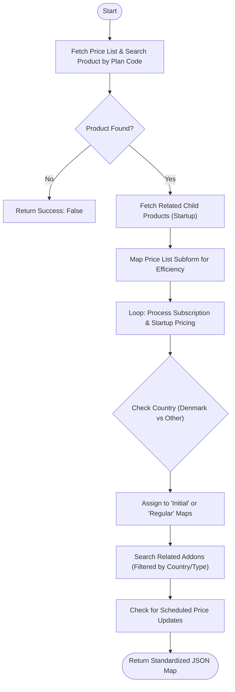

**Postman Documentation:** [Link to API Collection Placeholder]

---

## Overview
The `delugePriceListPricingHandler` function is a centralized pricing engine within the Cordulus ecosystem. It retrieves and standardizes pricing data from the **Price Lists** module based on a specific product plan and the customer's billing country. It differentiates between initial startup costs, recurring subscription fees, and associated addons, while also accounting for future "Scheduled" price changes.

## Technical Contract
- **Input:** 
    - `Int price_list_id`: The ID of the Price List record in CRM.
    - `String billing_country`: The country of the billing entity (used for tax/code logic).
    - `String conversion_plan_code`: The Zoho Billing Plan Code used to look up the base product.
- **Output:** A JSON Map containing `success` (boolean) and four distinct price maps: `initial`, `regular`, `addon`, and `scheduled`.
- **Primary Entities:** 
    - `Price_Lists` (Zoho CRM Module)
    - `Products` (Zoho CRM Module)
    - `Subform_2` (Price List line items)
    - `Price_List_for_Addons` (Addon-specific subform)

## Dependency Map
This script orchestrates the following internal functions and external services:

| Function / Service | Purpose | Criticality |
| --- | --- | --- |
| Zoho CRM API | Data retrieval for Products, Price Lists, and Related Lists. | High |

## Logic Flow

## Core Logic Sections

### 1. Data Retrieval and Validation
The script begins by fetching the `Price List` record and searching the `Products` module for a record matching the `conversion_plan_code`. It also identifies "Child Products" via the `Related_Child_Products` relationship, which typically represents one-time startup or installation fees associated with a subscription plan.

### 2. Efficiency Mapping
To avoid nested loops with high O(n) complexity, the script maps the `Price_List` subform into a Map object (`subformMap`) using the Product ID as the key. This allows for O(1) lookups during the main processing phase.

### 3. Subscription & Startup Processing
The script iterates through the Main Product (Subscription) and the Child Product (Startup). It determines the correct product code based on the `billing_country` (Denmark vs. Others).
- **New Sales:** Populates the `initial` map (Startup costs + Initial Subscription).
- **Renewals:** Populates the `regular` map for recurring revenue.

### 4. Addon Filtering and Scheduling
Addons are filtered based on the `billing_country`. 
- If the country is "United Kingdom," it searches for addons containing the string "Subscription."
- For other countries, it searches for "One-Time" addons.
The script also checks for `New_Price_Net` fields in the subforms; if populated, these are added to the `scheduled` map to handle upcoming price increases or decreases.

## Developer Notes

> [!WARNING]
> The script relies on hardcoded subform names (`Subform_2` and `Price_List_for_Addons`). If the CRM layout is modified or these subforms are renamed, the script will fail to retrieve pricing data.

> [!IMPORTANT]
> The logic for Denmark vs. "Other" countries is hardcoded into the product code selection (`Product_Code_Denmark` vs `Product_Code_Other`). Ensure these fields exist on all Product records.

> [!TIP]
> The addon search logic uses string containment (`.contains()`). Ensure that Addon product names in the CRM follow a strict naming convention ("Subscription" or "One-Time") to avoid filtering errors.

## Change Log
- **2026-03-19T19:57:13.167Z:** Initial creation of documentation via DeluluDocu. Added logic for scheduled pricing and regional addon filtering.