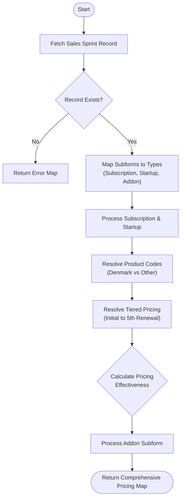

**Postman Documentation:** [Link to API Collection Placeholder]

---

## Overview
The `delugeSalesSprintPricingHandler` is a specialized utility script within the Cordulus ecosystem designed to calculate complex pricing structures for **Sales Sprints**. It handles the logic for tiered pricing (initial year through 5th renewal), resolves correct product codes based on the billing country (Denmark vs. Others), and determines if the sprint's accrual-based pricing remains effective for current or upcoming renewal cycles.

This script is typically triggered during the checkout or renewal process where specific "Sales Sprint" discounts and terms need to be applied to a Subscription.

## Technical Contract
- **Input:** 
    - `sales_sprint_id` (Int): The ID of the Sales Sprint record in CRM.
    - `current_renewal_cycle` (Int): The current age of the subscription in years.
    - `billing_country` (String): The country name used to toggle product code mapping.
- **Output:** A structured Map containing pricing tiers (`initial`, `regular`, `upcoming`, `addon`) and metadata (`info`).
- **Primary Entities:** 
    - `Sales_Sprints` (CRM)
    - `Products` (CRM)

## Dependency Map
This script orchestrates the following internal functions and external services:

| Function / Service | Purpose | Criticality |
| --- | --- | --- |
| `zoho.crm.getRecordById` | Fetches Sprint details and Product/Addon metadata. | High |

## Logic Flow

## Core Logic Sections

### 1. Data Categorization
The script first iterates through the `Pricing_and_Renewal_Detai` and `Sales_Sprint_Addons` subforms. It uses string matching (e.g., `.contains("Subscription")`) to categorize rows into a local Map. This prevents multiple loops through the subforms in later stages.

### 2. Product Code & Accrual Logic
The script handles two specific product code lookups:
- **Standard Sales:** Used for Startups and new Subscription sales (Cycle 0 with 12-month accrual).
- **Accrual Based:** Looked up via the `Accrual_Based_Product_Cod` subform on the Product record. It matches the code specifically to the `Accrual_Period_in_Months` defined on the Sprint.

### 3. Tiered Pricing Resolution
Pricing is resolved by index using the `tiers` list:
`{"Initial_Year", "First_Renewal", "Second_Renewal", "Third_Renewal", "Fourth_Renewal", "Fifth_Renewal"}`.
The `current_renewal_cycle` integer is used as the index to pull the specific column value from the subform row.

### 4. Pricing Effectiveness
This section determines if the Sales Sprint terms are still valid by comparing the total months elapsed (Cycle * 12) against the Sprint's `Accrual_Period_in_Months`.
- **Current Cycle:** `(current_renewal_cycle * 12) < accrual_months`
- **Upcoming Cycle:** `((current_renewal_cycle + 1) * 12) < accrual_months`

## Developer Notes

> [!IMPORTANT]
> The script relies on hardcoded string matching for product identification (`"Subscription"`, `"Startup"`). If product naming conventions change in the CRM, this mapping logic will break.

> [!CAUTION]
> The tiered pricing list is finite (up to 5th renewal). If a `current_renewal_cycle` greater than 5 is passed, the script will not find a corresponding price in the `tiers` map, potentially returning null prices for `regular` or `upcoming` tiers.

> [!TIP]
> This script is purely a calculator. It does not update any CRM records; it only returns a Map for the calling function to use in further automation (like Quote or Invoice creation).

## Change Log
- **2026-03-19T20:13:33.522Z:** Initial creation of documentation via DeluluDocu. 
- **2026-03-19T20:13:33.522Z:** Logic implemented to handle accrual-based product codes for renewals.