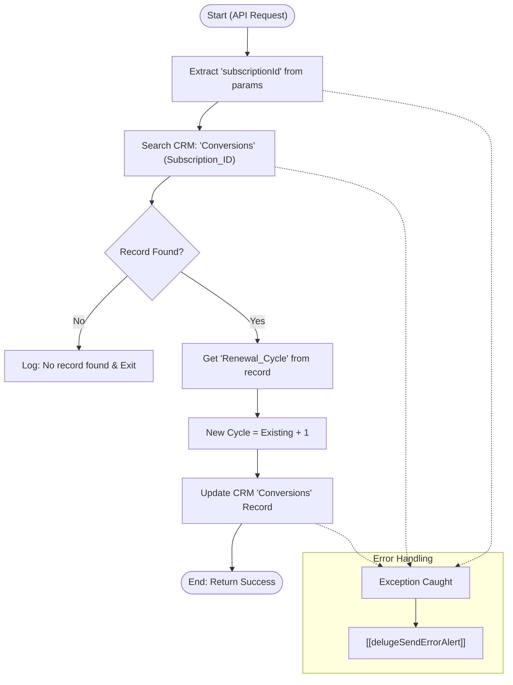

**Postman Documentation:** [Link to API Collection Placeholder]

---

## Overview
The `delugeSubscriptionCycleHandler` is a standalone utility designed to track and increment the renewal history of a subscription within the Zoho CRM "Conversions" module. When triggered (typically by an external subscription renewal event), it locates the corresponding record and increments the `Renewal_Cycle` field by 1. This ensures accurate reporting on how many times a specific customer has renewed their service, and triggers the [[delugeConversionPricingHandler]] script.

## Technical Contract
- **Input:** `String crmAPIRequest` (A JSON string containing a `params` object with `subscriptionId`).
- **Output:** `String` (Success message or an error log string).
- **Primary Entities:** Zoho CRM (Conversions Module).

## Dependency Map
This script orchestrates the following internal functions and external services:

| Function / Service | Purpose | Criticality |
| --- | --- | --- |
| [[delugeSendErrorAlert]] | Dispatches error details if the record search or update fails. | High |

## Logic Flow

## Core Logic Sections

### 1. Initialization and Extraction
The script begins by parsing the `crmAPIRequest`. It specifically targets the `subscriptionId` within the parameters. This ID serves as the unique key to link the external subscription event to the internal CRM record.

### 2. CRM Record Lookup
Using the `zoho.crm.searchRecords` method, the script searches the "Conversions" module for a matching `Subscription_ID`. If the search returns no results, the script terminates gracefully to avoid unnecessary processing, as there is no record to update.

### 3. Cycle Increment & Persistence
If a record is found, the script retrieves the current value of the `Renewal_Cycle` field. It increments this integer by 1 and sends a `zoho.crm.updateRecord` call back to the CRM. The update is configured with `{"trigger":{"workflow"}}`, ensuring that any CRM workflows dependent on renewal cycle changes (e.g., loyalty alerts) are executed.

## Developer Notes

> [!IMPORTANT]
> This script uses the `Conversions` module. Ensure that the field `Subscription_ID` is indexed/searchable in Zoho CRM to prevent timeout issues as the record count grows.

> [!CAUTION]
> The script uses `.get(0)` on search results. If multiple conversion records share the same Subscription ID, only the most recently created or top-indexed record will be updated.

> [!TIP]
> If `Renewal_Cycle` is empty/null on the CRM record, Deluge typically treats the addition as `0 + 1`. However, it is good practice to ensure the field has a default value of `0` in the CRM layout to avoid potential null-pointer math errors in future Deluge versions.

## Change Log
- **2026-03-19T20:14:02.318Z:** Initial creation of documentation via DeluluDocu.