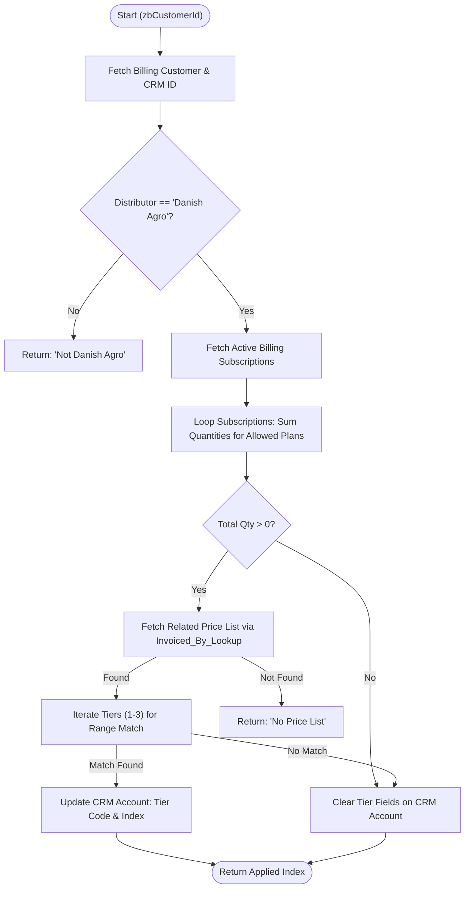

**Postman Documentation:** [Link to API Collection Placeholder]

---

## Overview
The `delugeTieredDiscountsHandler` is a standalone utility designed to automate discount management for Danish Agro customers within the Cordulus ecosystem. 

The script is triggered (typically via a webhook or scheduled task) for a specific Zoho Billing Customer. It aggregates the total quantity of active weather station plans (specifically codes `1200` and `1200-SM`), determines which discount tier the customer qualifies for based on the total unit count, and retrieves the specific price index from a related "Price List" record in Zoho CRM. Finally, it synchronizes these values back to the Zoho CRM Account record for use in billing and reporting.

## Technical Contract
- **Input:** `Int zbCustomerId` (The unique ID of the customer in Zoho Billing)
- **Output:** `string` (Returns the applied Tier Index value, or an error/status message)
- **Primary Entities:** 
    - Zoho Billing (Customers, Subscriptions)
    - Zoho CRM (Accounts, Related Price Lists)

## Dependency Map
This script orchestrates the following internal functions and external services:

| Function / Service | Purpose | Criticality |
| --- | --- | --- |
| Zoho Billing API | Used to fetch customer metadata and active subscription counts. | High |
| Zoho CRM API | Used to validate distributor identity and update Account discount tiers. | High |
| Price List (Custom Module) | Stores the specific tier values/indices for each distributor. | High |

## Logic Flow

## Core Logic Sections

### 1. Distributor Validation
The script strictly enforces a business rule that tiered discounts handled by this logic apply only to customers associated with the **"Danish Agro"** distributor. It fetches the CRM Account associated with the Billing Customer to verify this lookup field before proceeding.

### 2. Subscription Aggregation & Quantity Summing
The script iterates through all subscriptions with an `ACTIVE` status. It filters for specific plan codes (`1200`, `1200-SM`). 

> [!IMPORTANT]
> Because the summary subscription response in Zoho Billing sometimes lacks the granular plan quantity, the script performs a `zoho.billing.retrieve` call inside the loop for every active subscription to ensure accurate count.

### 3. Range-Based Tier Matching
The script uses a hardcoded configuration list (`tiers`) representing the business logic:
- **Tier 1:** 3-4 Units
- **Tier 2:** 5-9 Units
- **Tier 3:** 10+ Units

It maps the quantity sum against these ranges and retrieves the corresponding field name (e.g., `Tier_1_3`). It then looks up that specific field's value on the **Price List** record associated with the account's distributor.

### 4. CRM Synchronization
The final stage updates three specific fields on the CRM Account:
- `Weather_Station_s`: The total count of active units.
- `Tiered_Discount`: The value retrieved from the Price List.
- `E_conomic_Product_Code_Discount_Tier`: The internal code for the matched tier (used for downstream ERP integrations).

## Developer Notes

> [!WARNING]
> **API Limits:** The script performs a GET request inside a loop (`zoho.billing.retrieve`). If a customer has a very high volume of individual subscriptions (e.g., 50+), this could potentially hit Deluge statement limits or Billing API rate limits.

> [!CAUTION]
> **Hardcoded Org ID:** The `orgId` "20087400261" is hardcoded. If the Zoho Billing organization is migrated or changed, this script will fail.

> [!TIP]
> **Extensibility:** To add a new tier, simply update the `tiers` list at the top of the script and ensure the corresponding field name exists in the CRM "Related Price List" module.

## Change Log
- **2026-03-19T20:28:12.723Z:** Initial creation of documentation via DeluluDocu. Matches script logic for Danish Agro tiered discounting.