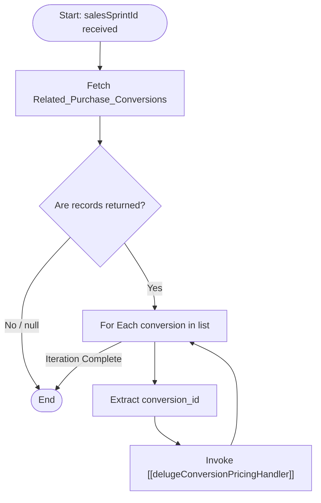

**Postman Documentation:** [Link to API Collection Placeholder]

---

## Overview
The `delugeUpdatePurchaseConversionsUpcomingRenewalDetails1` function serves as an orchestrator within the Cordulus CRM environment. Its primary purpose is to refresh pricing and renewal details for all **Purchase Conversions** associated with a specific **Sales Sprint**. It acts as a batch processor that triggers the granular pricing logic for each individual conversion record linked to the sprint.

## Technical Contract
- **Input:** `Int salesSprintId` (The unique ID of the Sales Sprint record).
- **Output:** `void` (Side effects: Triggers updates on related Purchase Conversion records).
- **Primary Entities:** 
    - `Sales_Sprints`
    - `Related_Purchase_Conversions` (Custom Module/Related List)

## Dependency Map
This script orchestrates the following internal functions and external services:

| Function / Service | Purpose | Criticality |
| --- | --- | --- |
| [[delugeConversionPricingHandler]] | Calculates and updates the pricing/renewal details for a specific Purchase Conversion. | High |

## Logic Flow

## Core Logic Sections

### 1. Record Retrieval
The script initiates by querying the CRM for all records in the `Related_Purchase_Conversions` module that are linked to the provided `salesSprintId`.

### 2. Validation & Iteration
A null check is performed on the returned list to prevent execution errors. If records exist, the script enters a `for each` loop to process them sequentially.

### 3. Individual Pricing Logic Trigger
For every record found, the script extracts the record ID and delegates the actual business logic (calculation of pricing and renewal details) to the `standalone.delugeConversionPricingHandler` function.

## Developer Notes

> [!IMPORTANT]
> This script does not handle pagination for `getRelatedRecords`. By default, this Zoho CRM task retrieves the first 200 records. If a Sales Sprint contains more than 200 Purchase Conversions, the script will need to be updated with a pagination loop.

> [!WARNING]
> Since this script iterates through multiple records and calls another function for each, it is susceptible to Deluge "Execution Time" limits if the related list is exceptionally large.

> [!TIP]
> This is an orchestration function. If changes are needed to the *way* pricing is calculated, those changes should be made in [[delugeConversionPricingHandler]], not here.

## Change Log
- **2026-03-19T19:29:19.998Z:** Initial creation of documentation via DeluluDocu.