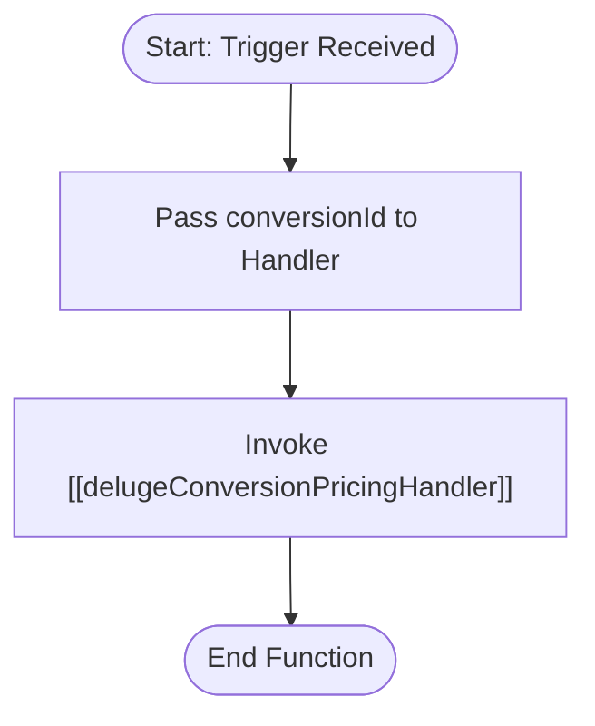

**Postman Documentation:** [Link to API Collection Placeholder]

---

## Overview
The `delugeUpdateConversionPricing` function serves as an automation wrapper within the Cordulus ecosystem. Its primary role is to act as a trigger-ready entry point (likely used in Workflows or Blueprints) that delegates the complex logic of pricing updates to a dedicated standalone handler. By decoupling the trigger from the logic, it allows for better maintainability and reuse of the pricing calculation engine.

## Technical Contract
- **Input:** 
    - `conversionId` (Int): The unique identifier for the Conversion record to be processed.
- **Output:** `void` (The function performs side effects by invoking another process).
- **Primary Entities:** 
    - Conversions (Zoho CRM/Custom Module)

## Dependency Map
This script orchestrates the following internal functions and external services:

| Function / Service | Purpose | Criticality |
| --- | --- | --- |
| [[delugeConversionPricingHandler]] | Executes the core pricing logic, tax calculations, and record updates. | High |

## Logic Flow

## Core Logic Sections

### 1. Functional Delegation
The script contains no native business logic. It acts strictly as a "Pass-through" or "Proxy." This is a design pattern used in Zoho Deluge to keep the `automation` namespace clean and redirect all heavy processing to the `standalone` namespace where utility functions reside.

## Developer Notes
> [!NOTE]
> This function is a wrapper. If pricing logic needs to be modified, do not edit this script; instead, navigate to the **[[delugeConversionPricingHandler]]** function.

> [!TIP]
> This pattern is ideal for Zoho CRM Workflows because if the underlying pricing logic changes, you only need to update the standalone script without risking the workflow configuration itself.

## Change Log
- **2026-03-19T19:00:31.292Z:** Initial creation of documentation via DeluluDocu.