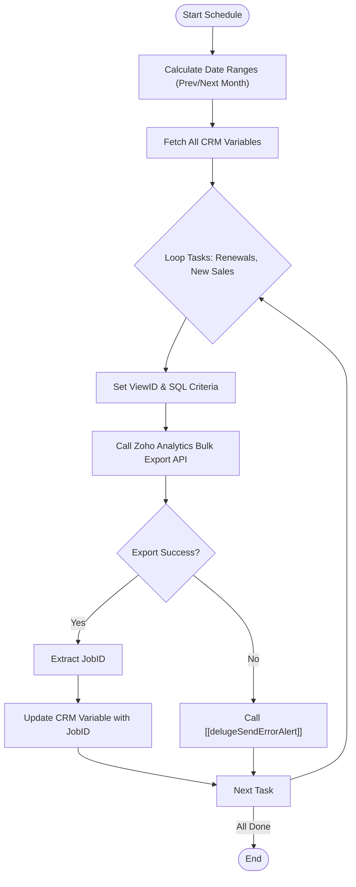

**Postman Documentation:** [Link to API Collection Placeholder]

---

## Overview
The `delugeInvoicingDataExportHandler` is a scheduled script designed to automate the generation of data export jobs from Zoho Analytics. It serves as the "Trigger" phase of the Cordulus invoicing pipeline. 

The script calculates two specific date ranges:
1.  **Renewals:** Records due for billing in the following month.
2.  **New Sales:** Records created in the previous month.

It initiates a bulk data export for these sets from specific Zoho Analytics views and then persists the resulting `jobId` into Zoho CRM Global Variables. This allows downstream processes (such as status checkers or data downloaders) to know which export jobs to monitor.

## Technical Contract
- **Input:** None (Scheduled Trigger)
- **Output:** Side effects: Initiates Analytics exports and updates Zoho CRM Variables.
- **Primary Entities:** Zoho Analytics (Bulk API v2), Zoho CRM (Settings Variables).

## Dependency Map
This script orchestrates the following internal functions and external services:

| Function / Service | Purpose | Criticality |
| --- | --- | --- |
| Zoho Analytics API | Triggers the bulk data export (JSON format) | High |
| Zoho CRM API | Fetches and updates Global Variables to store Job IDs | High |
| [[delugeSendErrorAlert]] | Handles error reporting to administrators if exports fail | Medium |

## Logic Flow

## Core Logic Sections

### 1. Date Calculations
The script dynamically determines the start and end dates for two distinct periods. 
- For **Renewals**, it looks ahead to the first and last day of the *next* month.
- For **New Sales**, it looks back at the first and last day of the *previous* month.
This ensures the script can run on any day of the month (though typically scheduled for the 1st) and target the correct data blocks.

### 2. Zoho Analytics Integration
The script utilizes the `restapi/v2/bulk` endpoint. It constructs a `CONFIG` map containing SQL-style criteria (e.g., `Next Billing Date >= '...'`). 

> [!NOTE]
> The script is configured specifically for the `.eu` multi-instance. Ensure that the `orgId` and `workspaceId` constants are updated if the environment is migrated.

### 3. State Persistence (CRM Variables)
To pass the `jobId` to other scripts, it iterates through the CRM Variables. It matches the `targetVarName` (e.g., "Temporary Renewals Export Job") to find the internal `varId` and then performs a `PUT` request to update the value.

## Developer Notes

> [!IMPORTANT]
> This script uses hardcoded IDs for `workspaceId` (Analytics) and `viewId`. If the Analytics views are deleted or recreated, these IDs MUST be updated in the configuration section of this script.

> [!CAUTION]
> The CRM Variable update uses the name as a lookup key. If the Variable name is changed in CRM Settings, the lookup will fail, and the Job ID will not be saved.

> [!TIP]
> This script uses the `zohocrmconnection` and `zohooauth` connections. Ensure these connections have scopes for `ZohoCRM.settings.ALL` and `ZohoAnalytics.data.ALL`.

## Change Log
- **2026-03-19T19:39:56.845Z:** Initial creation of documentation via DeluluDocu. 
- **2026-03-19T19:40:00.000Z:** Added support for "New Sales" export logic and consolidated date calculation logic.