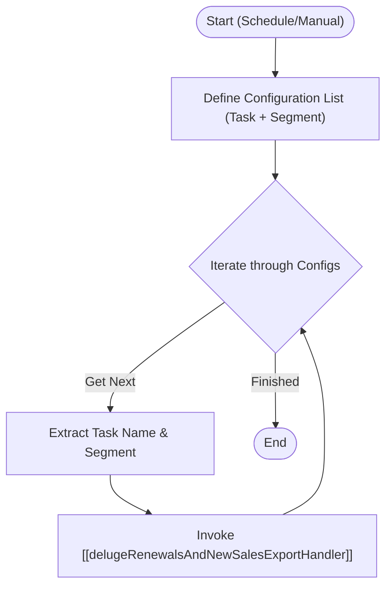

**Postman Documentation:** [Link to API Collection Placeholder]

---

## Overview
This script acts as an orchestrator (wrapper) within the Cordulus ecosystem. Its primary purpose is to define and trigger a batch of data export tasks for Renewals and New Sales across different business segments (Cordulus and Cropline). It iterates through a predefined configuration list and passes parameters to a specialized standalone handler script.

## Technical Contract
- **Input:** None (Void)
- **Output:** Void (Side effect: Sequential execution of sub-routines)
- **Primary Entities:** 
    - Internal Sales/Renewal Data
    - Export Processing Logic

## Dependency Map
This script orchestrates the following internal functions and external services:

| Function / Service | Purpose | Criticality |
| --- | --- | --- |
| [[delugeRenewalsAndNewSalesExportHandler]] | Executes the actual export logic for a specific task and segment. | High |

## Logic Flow

## Core Logic Sections

### 1. Configuration Definition
The script manually defines a `List` of `Map` objects. Each map contains a `task` ("Renewals" or "New Sales") and a `segment` ("Cordulus" or "Cropline"). This allows for centralized management of which export batches should be processed during the execution.

### 2. Iterative Orchestration
The script uses a `for each` loop to cycle through the defined configurations. This pattern ensures that the export logic is modular; the orchestrator handles the "what" and "when," while the called standalone script handles the "how."

## Developer Notes

> [!NOTE]
> This function executes tasks sequentially. If the standalone script logic is heavy, ensure that the overall execution time does not exceed Zoho's timeout limits (usually 40 seconds for basic scripts, or higher for scheduled tasks).

> [!TIP]
> To add a new segment or task type to the export routine, simply add a new map entry to the `configs` list at the beginning of the script.

## Change Log
- **2026-03-19T20:28:35.480Z:** Initial creation of documentation via DeluluDocu.