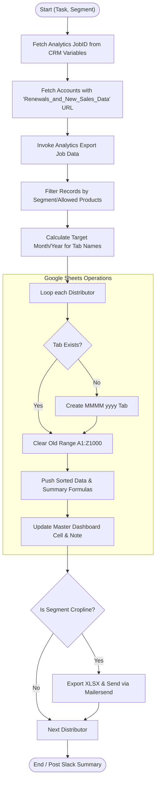

**Postman Documentation:** [Link to API Collection Placeholder]

---

## Overview
The `delugeRenewalsAndNewSalesExportHandler` script is a critical integration component that bridges Zoho Analytics, Zoho CRM, and Google Sheets. Its primary purpose is to take processed financial data (either upcoming Renewals or previous month's New Sales) exported from Zoho Analytics and distribute it into specific Google Spreadsheets owned by individual Distributors. 

Furthermore, it updates a centralized "Master Tracking Dashboard" for internal Cordulus monitoring and, for the "Cropline" segment, automatically exports the resulting data as an Excel file and emails it to stakeholders via Mailersend.

## Technical Contract
- **Input:** 
    - `String task`: Determines the logic mode. Accepted values: `"Renewals"` or `"New Sales"`.
    - `String segment`: Determines the product filtering and target spreadsheet columns. Accepted values: `"Cordulus"` or `"Cropline"`.
- **Output:** `String` (Returns an empty string upon completion).
- **Primary Entities:** 
    - **Zoho CRM**: Accounts (Distributors) and Settings Variables (Job IDs).
    - **Zoho Analytics**: Bulk Export API v2.
    - **Google Sheets**: Individual Distributor spreadsheets and Master Dashboard (`1iM5nTGy...` or `15NpCTxm...`).
    - **Mailersend**: External email delivery service.

## Dependency Map
This script orchestrates the following internal functions and external services:

| Function / Service | Purpose | Criticality |
| --- | --- | --- |
| [[delugeSendErrorAlert]] | Handles error reporting to administrators if sheet creation or data clearing fails. | High |
| [[delugePostSuccessMessageToSlack]] | Sends a summary breakdown of processed quantities to Slack. | Low |
| **Zoho Analytics API** | Source of truth for the processed data records. | Blockers |
| **Google Sheets API** | Target destination for data visualization and distribution. | Blockers |
| **Mailersend API** | Used to deliver XLSX exports to Cropline distributors. | Medium |

## Logic Flow

## Core Logic Sections

### 1. Configuration & Data Retrieval
The script first identifies the `jobId` for the Analytics export by querying CRM Settings Variables. It then identifies all "Distributor" accounts in the CRM that have a spreadsheet URL configured. It dynamically selects either the standard or "Cropline" spreadsheet ID based on the `segment` input.

### 2. Zoho Analytics Integration
Using the Zoho Analytics REST API v2, the script fetches the JSON data resulting from a pre-configured Export Job. This job contains the calculated pricing, tiered discounts, and product details for the relevant period.

### 3. Data Transformation & Filtering
The data is filtered by `allowedProducts` (e.g., "Cordulus Farm" for the Cordulus segment). The script organizes the flat list of records into a Map where keys are Distributor names and values are lists of rows, including a standardized header row. 

### 4. Tab & Row Management
- **Target Dates**: If the task is "Renewals", it targets next month. If "New Sales", it targets the previous month.
- **Sorting**: Rows are sorted alphabetically by "Account Name" (Column C) using a temporary Map to ensure consistent presentation in the Google Sheet.
- **Formulas**: The script injects Google Sheets formulas (e.g., `=SUM(O8:O)`) at the top of the sheet for real-time summary calculations.

### 5. Master Dashboard Synchronization
The script locates the correct row in the "Master Tracking Dashboard" by matching the Distributor Name and Task. It calculates the total quantity of subscriptions/units and updates the specific cell corresponding to the target month. It also attaches a **Google Sheets Note** to the cell containing a timestamp of the update.

## Developer Notes

> [!IMPORTANT]
> This script relies on exact matching of "Account Name" between Zoho CRM and the "Master Tracking Dashboard" spreadsheet. If a distributor's name is changed in CRM without updating the dashboard, the Master Dashboard update will fail (though the individual sheet will still update).

> [!WARNING]
> **Hardcoded IDs**: The script contains hardcoded Workspace IDs, Org IDs, and Dashboard Spreadsheet IDs. If the Analytics workspace or the Master spreadsheets are recreated, these variables must be updated manually.

> [!TIP]
> **Performance**: The script fetches the Master Dashboard row values once per execution (`dashboardMeta`) rather than per-distributor to avoid hitting Google Sheets API rate limits during large batch runs.

## Change Log
- **2026-03-19T19:39:37.540Z:** Initial creation of documentation via DeluluDocu. Added logic for dynamic Year/Month tab targeting and Mailersend integration for Cropline.