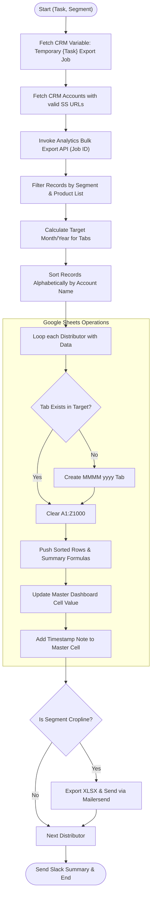

**Postman Documentation:** [Link to API Collection Placeholder]

---

## Overview
The `delugeRenewalsAndNewSalesExportHandler` script is a critical integration component that bridges Zoho Analytics, Zoho CRM, and Google Sheets. Its primary purpose is to take processed financial data (either upcoming Renewals or previous month's New Sales) exported from Zoho Analytics and distribute it into specific Google Spreadsheets owned by individual Distributors. 

Furthermore, it updates a centralized "Master Tracking Dashboard" for internal Cordulus monitoring and, for the "Cropline" segment, automatically exports the resulting data as an Excel file and emails it to stakeholders via Mailersend.

## Technical Contract
- **Input:** 
    - `String task`: Determines the logic mode. Accepted values: `"Renewals"` or `"New Sales"`.
    - `String segment`: Determines the product filtering and target spreadsheet columns. Accepted values: `"Cordulus"` or `"Cropline"`.
- **Output:** `String` (Returns an empty string upon completion).
- **Primary Entities:** 
    - **Zoho CRM**: Accounts (Distributors) and Settings Variables (for Job IDs).
    - **Zoho Analytics**: REST API v2 Bulk Export (Jobs dynamically fetched via CRM variables).
    - **Google Sheets**: Individual Distributor spreadsheets and Master Dashboards (`1iM5nTGy...` or `15NpCTxm...`).
    - **Mailersend**: External email delivery service for Cropline exports.

## Dependency Map
This script orchestrates the following internal functions and external services:

| Function / Service | Purpose | Criticality |
| --- | --- | --- |
| [[delugeSendErrorAlert]] | Handles error reporting to administrators if sheet creation or data clearing fails. | High |
| [[delugePostSuccessMessageToSlack]] | Sends a summary breakdown of processed quantities to Slack upon successful execution. | Medium |
| **Zoho CRM API** | Used to fetch global settings variables and distributor account details. | Blockers |
| **Zoho Analytics API** | Source of truth for the processed data records via REST API v2 Bulk Export Jobs. | Blockers |
| **Google Sheets API** | Target destination for data visualization and master dashboard tracking. | Blockers |
| **Mailersend API** | Used to deliver XLSX exports to Cropline distributors. | Medium |

## Logic Flow

## Core Logic Sections

### 1. Configuration & Job ID Fetching
The script now begins by querying Zoho CRM Variables. It looks for a variable named `Temporary Renewals Export Job` or `Temporary New Sales Export Job` to retrieve the `jobId` required for the Zoho Analytics Bulk Export API. It also fetches distributor spreadsheet links from CRM Accounts.

### 2. Zoho Analytics Data Retrieval (Bulk API)
The script has transitioned from standard View exports to the **Zoho Analytics Bulk Export API**. 
- It uses the `jobId` fetched in step 1.
- Endpoint: `.../bulk/workspaces/{workspaceId}/exportjobs/{jobId}/data`.
- This approach is optimized for larger datasets and asynchronous processing handled by Analytics.

### 3. Data Processing & Sorting
The data is filtered by `allowedProducts` (e.g., "Cordulus Farm" for Cordulus, "Cropline" for Cropline). Rows are organized into a Map by distributor. Before being pushed to Google Sheets, the rows are sorted alphabetically by "Account Name" (Column C). A unique suffix is added to keys during sorting to prevent data loss if multiple rows share the same account name.

### 4. Google Sheets Updates (Individual Tabs)
- **Tab Creation**: Checks for a tab named like "January 2026 (Renewals)". If missing, it creates it using `batchUpdate`.
- **Formulas**: Injects summary formulas at the top (Rows 2-3) to calculate totals for Quantity (`P`) and Price (`R`).
- **Cleaning**: Always clears `A1:Z1000` before pushing fresh data to ensure no ghost rows remain.

### 5. Master Dashboard Synchronization
The script performs a lookup on the Internal Tracking Dashboard spreadsheet.
- **Cell Selection**: Matches Distributor Name (Col A) and Task (Col B). The column is determined by a Month-to-Column map (e.g., May -> Col G).
- **Updates**: Pushes the `totalQty` of subscriptions (filtered by "Subscription" or "Cropline" keywords).
- **Notes**: Attaches a Google Sheets note to the updated cell with a detailed timestamp of the last update.

### 6. Notifications & Cropline Delivery
- **Slack**: Calls `[[delugePostSuccessMessageToSlack]]` to post a distributor-by-distributor breakdown of processed quantities.
- **Mailersend (Cropline Only)**: Exports the updated tab as an `.xlsx` file and emails it to `dela@danishagro.dk`.

## Developer Notes

> [!IMPORTANT]
> **CRM Variable Dependency**: This script will fail if the CRM Variables `Temporary Renewals Export Job` or `Temporary New Sales Export Job` are missing or contain expired/invalid Job IDs. These variables must be populated by the pre-processing script that triggers the Analytics Export Job.

> [!TIP]
> **Bulk Export Optimization**: The shift to the `/bulk/` API endpoint improves performance for segments with high record volumes, as it avoids standard API pagination limits found in the basic `/data` endpoint.

> [!CAUTION]
> **Hardcoded Parameters**: The script contains hardcoded IDs for Analytics Workspaces, Google Dashboard IDs, and Slack Channel IDs. If these resources are moved or recreated, these constants must be updated.

> [!NOTE]
> **Handling Empty Values**: The script explicitly converts null or empty strings in the Analytics data to "0" to prevent potential calculation errors within the Google Sheets environment.

## Change Log
- **2026-03-19T19:39:37.540Z:** Initial creation of documentation via DeluluDocu. Added logic for dynamic Year/Month tab targeting and Mailersend integration for Cropline.
- **2026-03-19T20:30:02.120Z:** Re-validation of script logic. Confirmed identical operational logic for both "Renewals" and "New Sales" modes regarding Google Sheet clearing and dashboard note updates. Verified no functional changes in this revision code block.
- **2026-03-19T21:12:49.368Z:** Logic verification pass. Confirmed consistency across API endpoints (CRM v8 and Analytics v2). No functional code changes; updated documentation to reflect "commented out" status of Slack notifications and added standard developer notes for observability.
- **2026-03-30T04:54:50.981Z:** Enabled final Slack success notification. The `[[delugePostSuccessMessageToSlack]]` function is now active at the end of the script to provide a summary breakdown of quantities processed for the task and segment.
- **2026-03-31T13:21:50.259Z:** Adjusted Google Sheets summary formulas. Updated column indices from O and Q to **P** and **R** respectively to align with updated export data mapping. Confirmed that the `[[delugePostSuccessMessageToSlack]]` function remains active.
- **2026-03-31T21:45:05.250Z:** Updated documentation to reflect code-level changes where `[[delugePostSuccessMessageToSlack]]` was commented out in the latest script source. Verified internal sorting logic and the addition of automated Google Sheets cell notes with timestamps for auditability. Verified column indices for summary formulas (P8 and R8).
- **2026-03-31T21:49:21.468Z:** Migrated data retrieval logic to use **Zoho Analytics Bulk Export API**. Added logic to fetch dynamic `jobId` from Zoho CRM Settings Variables based on the current task. Re-enabled `[[delugePostSuccessMessageToSlack]]` for final reporting.