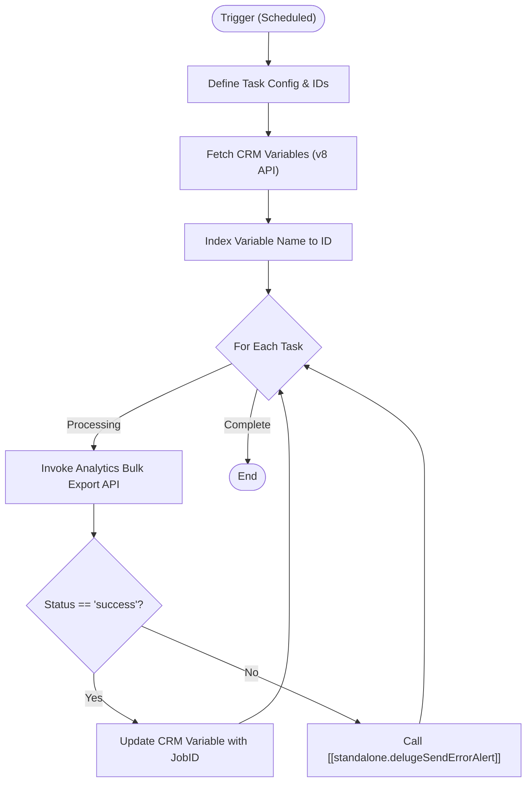

**Postman Documentation:** [Link to API Collection Placeholder]

---

## Overview
The `delugeMirrorDataExportHandler` is a scheduled script designed to orchestrate bulk data exports from Zoho Analytics to Zoho CRM. It triggers specific view exports (Renewals, New Sales, and KPI data), captures the generated `jobId` from Zoho Analytics, and stores that ID in Zoho CRM Global Variables. This enables downstream processes to retrieve the exported CSV data using the most recent Job ID.

## Technical Contract
- **Input:** None (Scheduled Function)
- **Output:** Side effects: Updates Zoho CRM Variables; Sends error alerts via standalone script on failure.
- **Primary Entities:** Zoho CRM (Variables), Zoho Analytics (Bulk API v2).

## Dependency Map
This script orchestrates the following internal functions and external services:

| Function / Service       | Purpose                                                       | Criticality |
| ------------------------ | ------------------------------------------------------------- | ----------- |
| [[delugeSendErrorAlert]] | Handles error reporting if an export job fails to initialize. | Medium      |
| Zoho Analytics API (v2)  | Provides the bulk export functionality and generates Job IDs. | High        |
| Zoho CRM API (v8)        | Used to fetch Variable IDs and update their values.           | High        |

## Logic Flow

## Core Logic Sections

### 1. Configuration Map
The script initializes a `taskConfig` map containing the technical `viewId` from Zoho Analytics and the corresponding `varName` target in Zoho CRM. It also defines static identifiers for the Analytics Workspace and Organization.

### 2. Variable Indexing
To avoid hardcoding CRM Variable IDs (which can change between environments), the script performs a `GET` request to the CRM v8 Settings API. It iterates through all available variables to build a dynamic mapping of `Name -> ID`.

### 3. Execution & Synchronization Loop
For every task defined in the configuration:
1.  It sends a `GET` request to the Analytics Bulk API to trigger a CSV export.
2.  If successful, it extracts the `jobId`.
3.  It performs a `PUT` request to the CRM API to update the designated variable with the new Job ID, ensuring the CRM always points to the latest data snapshot.

## Developer Notes

> [!IMPORTANT]
> This script is configured for the **.eu** Data Center (`zohoapis.eu` and `analytics.zoho.eu`). If deploying to .com or .in environments, these endpoints must be updated.

> [!WARNING]
> The script relies on two distinct connections: `zohocrmconnection` (CRM API) and `zohooauth` (Analytics API). Ensure both have sufficient scopes for Reading/Writing variables and Bulk API access respectively.

> [!TIP]
> The Analytics Bulk API is asynchronous. This script only captures the `jobId` that *starts* the export. Any subsequent script attempting to download the file must first check the job status using that ID.

## Change Log
- **2026-03-19T20:12:30.853Z:** Initial creation of documentation via DeluluDocu.