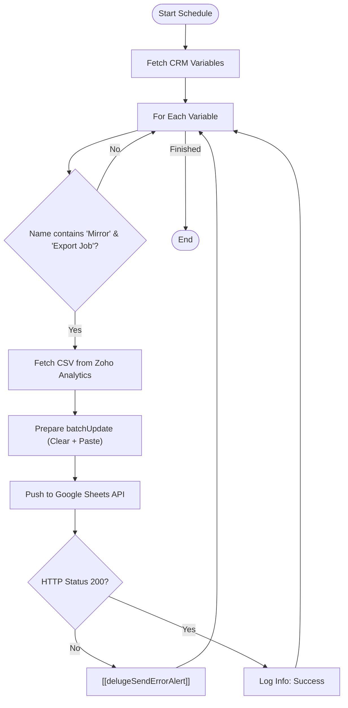

**Postman Documentation:** [Link to API Collection Placeholder]

---

## Overview
The `delugeMirrorExportsHandler` is a scheduled script designed to synchronize data between Zoho Analytics and Google Sheets. It acts as a bridge that identifies specific "Mirror" export jobs defined in Zoho CRM Variables, fetches the corresponding data as CSV from Zoho Analytics, and performs a destructive update (Clear + Paste) on a target Google Spreadsheet.

## Technical Contract
- **Input:** None (Scheduled Function)
- **Output:** void (Side effects: Updates Google Sheets, sends error alerts)
- **Primary Entities:** 
    - **Zoho CRM:** Stores configuration via Variables (Job IDs and Sheet GIDs).
    - **Zoho Analytics:** Source of truth for data exports.
    - **Google Sheets:** Target destination for data mirroring.

## Dependency Map
This script orchestrates the following internal functions and external services:

| Function / Service | Purpose | Criticality |
| --- | --- | --- |
| [[delugeSendErrorAlert]] | Logs failures and notifies administrators if an export fails. | High |
| **Zoho CRM API** | Retrieves the list of variables defining which jobs to run. | High |
| **Zoho Analytics API** | Provides the raw CSV data from predefined export jobs. | High |
| **Google Sheets API** | Receives the `batchUpdate` request to clear and populate data. | High |

## Logic Flow

## Core Logic Sections

### 1. Configuration & Variable Parsing
The script iterates through all Zoho CRM variables. It filters for specific entries where the name contains "Mirror" and "Export Job". 
- **Value Field:** Expected to contain the Zoho Analytics `jobId`.
- **Description Field:** Expected to contain the Google Sheet `targetSheetGid`.

### 2. Analytics Data Retrieval
Using the `jobId` extracted from the CRM variables, the script calls the Zoho Analytics V2 API. It requests the data in CSV format. This requires the `ZANALYTICS-ORGID` header and a valid `zohooauth` connection.

### 3. Google Sheets Batch Update
To ensure a clean sync, the script uses the Google Sheets `batchUpdate` endpoint with two specific requests:
1.  **updateCells (Clear):** Wipes `userEnteredValue` from the target GID to prevent old data trailing behind.
2.  **pasteData:** Injects the CSV data using `PASTE_NORMAL` starting at cell A1 (`rowIndex:0, columnIndex:0`).

## Developer Notes

> [!IMPORTANT]
> This script relies on a specific naming convention in Zoho CRM Variables. If the variable name does not contain both "Mirror" and "Export Job", the sync will be skipped.

> [!WARNING]
> The script uses a "Clear and Paste" methodology. Any manual formatting or formulas inside the data range in the destination Google Sheet may be overwritten or cleared depending on the range settings.

> [!TIP]
> If a sync fails, check the "Description" field of the CRM Variable. Ensure it contains *only* the numeric GID of the specific tab in the Google Sheet, not the full URL.

> [!TIP]
> Fixed a critical JSON formatting bug where the `requests` parameter was being passed as a Map instead of a List/Array. Using `[]` instead of `{}` ensures compatibility with the Google Sheets `batchUpdate` endpoint.

## Change Log
- **2026-03-19T19:39:48.731Z:** Initial creation of documentation via DeluluDocu.
- **2026-03-25T14:48:17.958Z:** Fixed JSON payload structure for Google Sheets API. Changed `requests` from a map-like collection to a formal Deluge list/array using `[]` to prevent 400 Bad Request errors during batch updates.