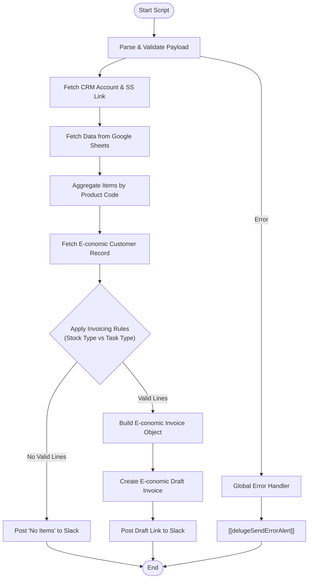

**Postman Documentation:** [Link to API Collection Placeholder]

---

## Overview
This function automates the generation of draft invoices in E-conomic based on sales and renewal data stored in Google Sheets. It acts as a bridge between Zoho CRM, Google Sheets, and the E-conomic accounting platform. 

The script is triggered (typically via a webhook or internal automation) with a payload identifying a distributor and a specific time period. It fetches the relevant spreadsheet, aggregates product lines, applies complex business logic based on the distributor's "Stock Type" (Sales vs. Consignment), and creates a draft invoice in E-conomic. It concludes by notifying the relevant team via Slack.

## Technical Contract
- **Input:** `crmAPIRequest` (String/Map) - A JSON payload containing `distributor_id`, `task_type` (Renewals/New Sales), `month`, `year`, and `download_link`.
- **Output:** `String` - Returns "success", "success: No items to invoice", or an error message prefixed with "error:".
- **Primary Entities:** 
    - **Zoho CRM:** Accounts Module.
    - **Google Sheets:** External data source for line items.
    - **E-conomic:** Customer records and Draft Invoices.
    - **Slack:** Notification destination.

## Dependency Map
This script orchestrates the following internal functions and external services:

| Function / Service | Purpose | Criticality |
| --- | --- | --- |
| Google Sheets API | Fetches the raw product/renewal data from the distributor's spreadsheet. | High |
| E-conomic REST API | Fetches customer metadata and creates the Draft Invoice. | High |
| [[delugePostSuccessMessageToSlack]] | Posts a formatted success message (including links) to Slack. | Medium |
| [[delugeSendErrorAlert]] | Alerts the development team if the process fails mid-execution. | Medium |

## Logic Flow

## Core Logic Sections

### 1. Data Retrieval and Aggregation
The script extracts data from a specific tab in Google Sheets named dynamically (e.g., "April 2026 (Renewals)"). It uses a `summaryMap` to aggregate quantities and prices for the same Product Code found across multiple rows, ensuring the final invoice is clean and consolidated. It also handles discount tiers as separate line items.

### 2. Business Rule Engine
The script applies specific accounting logic to decide which items are invoiced or credited:
- **New Sales + Stock Type 'Sales':** Only credits negative items.
- **New Sales + Stock Type 'Consignment':** Invoices positive items.
- **Renewals + Stock Type 'Sales':** Invoices positive items and credits discount items.
- **Renewals + Stock Type 'Consignment':** Invoices positive items.

### 3. E-conomic Integration
It translates Zoho/Sheet data into the E-conomic API schema, mapping currency, payment terms, VAT zones, and layouts. It performs currency conversion using an `exchange_rate` provided in the payload (defaulting to 1).

## Developer Notes

> [!IMPORTANT]
> The script relies on a hardcoded Slack Channel ID `C09PTU8KKT3`. If the notification channel needs to change, this variable must be updated.

> [!WARNING]
> The spreadsheet parsing is dependent on exact header names: "Item Name", "E-conomic Product Code", and "Quantity". If the Google Sheet template headers change, the script will fail to find data.

> [!TIP]
> The script includes a dynamic header row finder (`headerRowIndex`), which allows for some flexibility if there are empty rows or metadata rows at the top of the Google Sheet.

## Change Log
- **2026-03-19T19:40:08.390Z:** Initial creation of documentation via DeluluDocu. 
- **2024-05-22:** Refactored to V2 to include discount aggregation logic and refined business rules for Consignment vs Sales stock types.