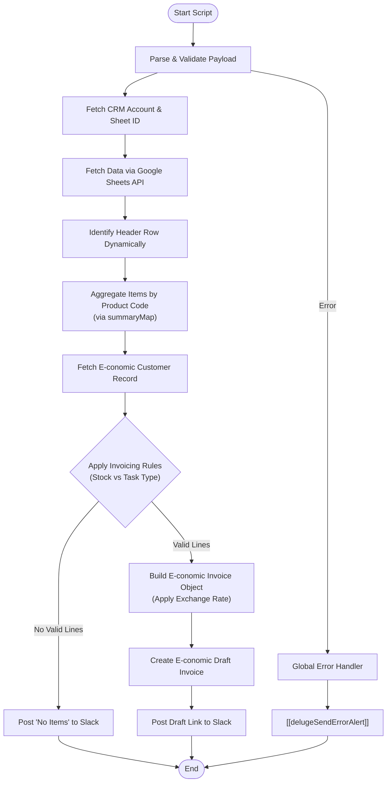

**Postman Documentation:** [Link to API Collection Placeholder]

---

## Overview
This function automates the generation of draft invoices in E-conomic based on sales and renewal data stored in Google Sheets. It acts as a bridge between Zoho CRM, Google Sheets, and the E-conomic accounting platform. 

The script is triggered with a payload identifying a distributor and a specific time period. It fetches the relevant spreadsheet, dynamically locates the correct tab and header row, aggregates product lines by code (including discounts), applies specific business logic based on the distributor's "Stock Type" (Sales vs. Consignment), and creates a draft invoice in E-conomic.

## Technical Contract
- **Input:** `crmAPIRequest` (String/Map) - A JSON payload containing `distributor_id`, `task_type` (Renewals/New Sales), `month`, `year`, `exchange_rate`, and `download_link`.
- **Output:** `String` - Returns "success", "success: No items to invoice", or an error message prefixed with "error:".
- **Primary Entities:** 
    - **Zoho CRM:** Accounts Module (for customer data and sheet links).
    - **Google Sheets:** External data source for line items.
    - **E-conomic:** Customer records and Draft Invoices.
    - **Slack:** Notification destination.

## Dependency Map
This script orchestrates the following internal functions and external services:

| Function / Service | Purpose | Criticality |
| --- | --- | --- |
| Google Sheets API | Fetches the raw product/renewal data from the distributor's spreadsheet. | High |
| E-conomic REST API | Fetches customer metadata and creates the Draft Invoice. | High |
| [[delugePostSuccessMessageToSlack]] | Posts a formatted success message (including links) to Slack. | Medium |
| [[delugeSendErrorAlert]] | Alerts the development team if the process fails mid-execution. | Medium |

## Logic Flow

## Core Logic Sections

### 1. Dynamic Tab and Header Discovery
The script constructs the tab name using the format `"Month Year (Task Type)"` (e.g., "April 2026 (Renewals)"). It iterates through the sheet values to find the header row dynamically, searching for "Item Name", "E-conomic Product Code", and "Quantity". This allows for variations in sheet structure.

### 2. Aggregation and Discount Handling
To prevent duplicate lines, the script uses a `summaryMap` keyed by the E-conomic Product Code. It sums up quantities and total prices for duplicate codes. It also checks for "E-conomic Product Code (Discount Tier)" to create separate discount line items, aggregating those as well.

### 3. Business Rule Engine
The script applies specific accounting logic based on the `invoice_type` and the Account's `Stock_Type`:
- **New Sales + Stock Type 'Sales':** Credits negative items only.
- **New Sales + Stock Type 'Consignment':** Invoices positive items only.
- **Renewals + Stock Type 'Sales':** Invoices positive items AND credits discount items.
- **Renewals + Stock Type 'Consignment':** Invoices positive items only.

### 4. E-conomic Integration & Exchange Rates
It maps E-conomic layout numbers, VAT zones, and payment terms from the customer record. Prices are converted using the `exchange_rate` provided in the payload (defaulting to 1 if empty).

## Developer Notes

> [!IMPORTANT]
> The script relies on a hardcoded Slack Channel ID `C09PTU8KKT3`. If the notification channel needs to change, this variable must be updated.

> [!CAUTION]
> There is a potential syntax error or logic bug on line 146: `if(summaryMap.contains(discountCode))`. In Deluge, the correct method to check for a key in a Map is `.containsKey()`. This may cause the discount aggregation to fail or return false incorrectly.

> [!TIP]
> The aggregation logic significantly improves invoice readability by consolidating items that appear multiple times in the source spreadsheet into a single line item with a summed quantity.

## Change Log
- **2026-03-19T19:40:08.390Z:** Initial creation of documentation via DeluluDocu. 
- **2024-05-22:** Refactored to V2 to include discount aggregation logic and refined business rules for Consignment vs Sales stock types.
- **2026-03-19T20:29:30.290Z:** Updated documentation to reflect V2 logic: added dynamic header discovery, `summaryMap` aggregation for products and discounts, and implemented exchange rate math on `unitNetPrice`. Documented potential `.contains()` bug in Map logic.