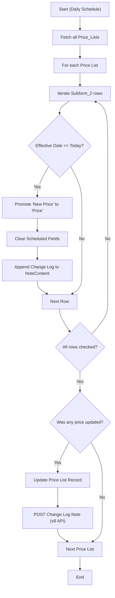

**Postman Documentation:** [Link to API Collection Placeholder]

---

## Overview
The `delugePriceListIncreaseHandlerSchedule` is a scheduled automation script designed to manage price adjustments within the Zoho CRM "Price Lists" module. It identifies products with a "New Price Effective Date" matching the current date and automatically promotes the scheduled "New Price" values to the active price fields. After the update, it clears the scheduled fields and logs the changes as a Note on the record for audit purposes.

## Technical Contract
- **Input:** None (Triggered by Zoho CRM Scheduler).
- **Output:** 
    - Updates `Price_Lists` records (Subform updates).
    - Creates `Notes` records via API.
- **Primary Entities:** 
    - `Price_Lists` (Module)
    - `Subform_2` (Subform within Price Lists)
    - `Notes` (Sub-resource of Price Lists)

## Dependency Map
This script orchestrates the following internal functions and external services:

| Function / Service | Purpose | Criticality |
| --- | --- | --- |
| Zoho CRM API | Fetching and updating Price List records and subforms. | High |
| Zoho CRM Notes API | Creating an audit trail of price changes via `invokeurl`. | Medium |
| `zohocrmconnection` | OAuth Connection for API authentication. | High |

## Logic Flow
The script follows a sequential processing model for each price list record found in the system.

## Core Logic Sections

### 1. Data Retrieval and Initialization
The script retrieves all records from the `Price_Lists` module. It captures the current system date in `yyyy-MM-dd` format to ensure an exact string match with the "Effective Date" field in the subform.

### 2. Subform Iteration and Price Promotion
The core logic resides within a nested loop:
- It iterates through `Subform_2`.
- It compares the `New_Price_Effective_Date` to `today`.
- If a match is found:
    - The `Price` and `Price_End_User` fields are overwritten with the `New_Price_Net` and `New_Price_End_User` values.
    - The scheduled fields (New Prices and Effective Date) are set to `null` to prevent re-processing.
    - An HTML-formatted string is appended to a change log.

### 3. Record Persistance and Auditing
If changes were made (`isUpdated == true`), the script performs two actions:
- **Record Update:** Uses `zoho.crm.updateRecord` to save the modified subform back to the Price List.
- **Audit Logging:** Uses `invokeurl` to send a POST request to the CRM Notes endpoint. This provides a permanent record of which prices were changed, by how much, and on what date.

## Developer Notes

> [!WARNING]
> **Hardcoded Module ID:** The script uses a hardcoded `moduleId` (`520877000309876284`). This ID is specific to the environment where it was created and may need to be updated if deployed to a different Zoho instance (e.g., Sandbox to Production).

> [!CAUTION]
> **Pagination Limit:** `zoho.crm.getRecords("Price_Lists")` only retrieves the first 200 records by default. If the organization has more than 200 price lists, a pagination loop or a search for records where the date matches will be required.

> [!TIP]
> **API Version Reference:** The `invokeurl` calls `v8` of the Price_Lists Notes API. Ensure that the CRM instance supports this version or adjust the URL to the standard `v2` or `v3` if receiving 404 errors.

> [!NOTE]
> **Subform Field Names:** This script relies on the technical names `Subform_2`, `New_Price_Net`, and `New_Price_End_User`. If the UI display names change, the script will continue to function as long as the API names remain stable.

## Change Log
- **2026-03-19T19:40:45.791Z:** Initial creation of documentation via DeluluDocu. (Price Promotion Logic Implemented).