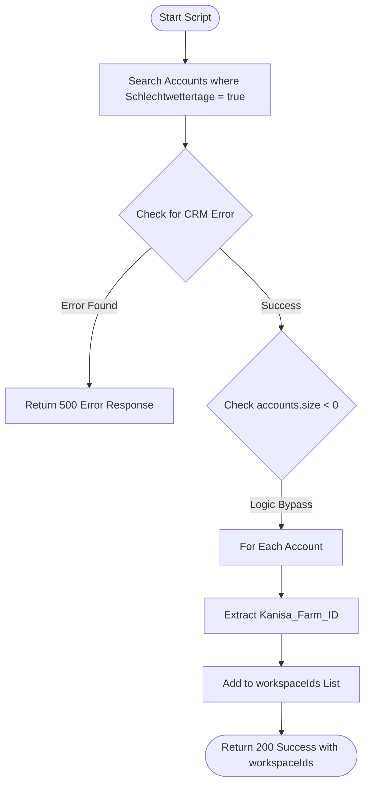

**Postman Documentation:** [Link to API Collection Placeholder]

---

## Overview
The `delugeGetWorkspaceIdsForSchlechtwetterAccounts` function is a standalone utility designed to facilitate the integration between Zoho CRM and the Cordulus backend. Its primary purpose is to identify and retrieve a list of unique Workspace IDs (`Kanisa_Farm_ID`) from CRM Account records that have the "Schlechtwettertage" (Bad Weather Days) feature enabled. 

This function acts as a discovery endpoint for the Cordulus backend, which then uses these IDs to trigger weather-specific logic via their own REST API.

## Technical Contract
- **Input:** None (Standalone function).
- **Output:** A JSON Map containing a `crmAPIResponse` object with a list of `workspaceIds`.
- **Primary Entities:** 
    - **Zoho CRM:** Accounts Module.

## Dependency Map
This script orchestrates the following internal functions and external services:

| Function / Service | Purpose                                               | Criticality |
| ------------------ | ----------------------------------------------------- | ----------- |
| Zoho CRM API       | Utilizes `zoho.crm.searchRecords` to filter accounts. | High        |

## Logic Flow

## Core Logic Sections

### 1. Data Retrieval
The script queries the Zoho CRM Accounts module using a criteria string to find all accounts where the custom boolean field `Schlechtwettertage` is set to `true`.

### 2. Error and Exception Handling
The script checks if the CRM response contains a "status: error" key. It also includes a logical check for the size of the results, though the current implementation contains a logical anomaly (checking for `< 0`).

### 3. Transformation
The script iterates through the resulting list of Account maps and extracts the value of `Kanisa_Farm_ID`. This value represents the Workspace ID required by the external Cordulus system.

## Developer Notes

> [!WARNING]
> **Logic Flaw in Size Check:** The line `if(accounts.size() < 0)` will never evaluate to true, as a collection's size cannot be negative. If the intent was to check for an empty list, this should be updated to `accounts.size() == 0`.

> [!IMPORTANT]
> **Pagination Limits:** The `zoho.crm.searchRecords` task returns a maximum of 200 records by default. If the number of accounts with "Schlechtwettertage" enabled exceeds 200, the script will currently only return the first 200. Pagination logic will be required for larger datasets.

> [!NOTE]
> The function is specifically formatted to return a `crmAPIResponse` map, making it compatible with Zoho CRM's API user-defined function requirements.

## Change Log
- **2026-03-19T17:43:34.249Z:** Initial creation of documentation via DeluluDocu.