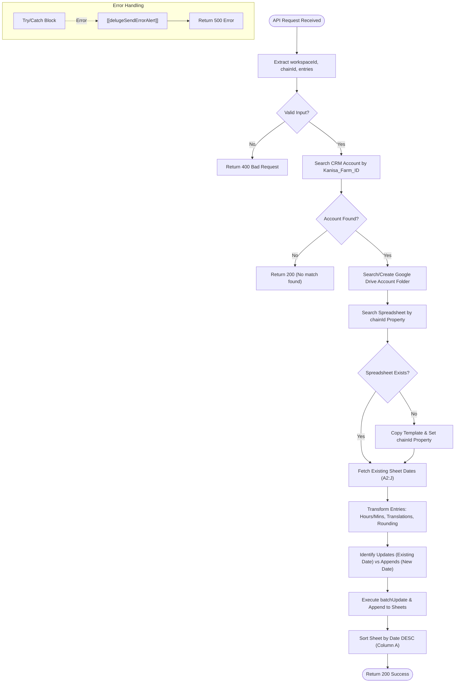

---
---
Function ID: "157805000000931088"
Name: delugeSchlechtwetterRestAPI
Revision Timestamp: 2026-03-19T17:43:26.649Z
Status: Functional
---
**Postman Documentation:** [Link to API Collection Placeholder]

---

## Overview
This script serves as a REST API endpoint for processing "Schlechtwetter" (Bad Weather) data from the Cordulus ecosystem. It receives weather entries associated with a specific workspace and chain, identifies the corresponding Zoho CRM Account, manages a dedicated Google Drive folder for that account, and synchronizes the weather data into a Google Spreadsheet. It handles file creation from templates, duplicate detection based on dates, and German translation of specific data statuses.

## Technical Contract
- **Input:** `String crmAPIRequest` (JSON body containing `workspaceId`, `chainId`, and an array of weather `entries`).
- **Output:** Returns a Map formatted for Zoho CRM API responses (`status_code` and `body` containing `code` and `message`).
- **Primary Entities:** Zoho CRM `Accounts`, Google Drive API, Google Sheets API.

## Dependency Map
This script orchestrates the following internal functions and external services:

| Function / Service | Purpose | Criticality |
| --- | --- | --- |
| [[delugeSendErrorAlert]] | Sends error notifications to administrators if a critical failure occurs. | High |
| Google Drive API | Used to search for account folders, create folders, and copy spreadsheet templates. | High |
| Google Sheets API | Used to write, update, append, and sort weather data within spreadsheets. | High |
| Zoho CRM | Used to map the `workspaceId` to a specific CRM Account via `Kanisa_Farm_ID`. | High |

## Logic Flow

## Core Logic Sections

### 1. Account & Folder Mapping
The script identifies the Zoho CRM Account using the `workspaceId`. Once identified, it ensures a Google Drive folder exists for that account under a specific parent directory (`1QKAw18ejhyeJfnkg4aXGEgSnn9DGR2nV`). If the folder is created, it is automatically shared with "anyone with the link" as a reader.

### 2. Spreadsheet Management via Custom Properties
Instead of relying solely on filenames, the script utilizes Google Drive's `custom properties`. It searches for files within the account folder where the property `chainId` matches the input. 
- If no match is found, it copies a master template (`1VS-l3xCR6Tj4_m_VkpYHAMqyoDHXw6yaPGJph9_is3E`).
- It dynamically updates the file name to reflect the `latestLabel` (most recent date's label) provided in the payload.

### 3. Data Transformation & Normalization
Before writing to Google Sheets, data is cleaned:
- **Duration:** Rain duration in minutes is converted to a string format: "X Std. Y Min."
- **Translation:** `INSUFFICIENT_DATA` is translated to "Nur Teil-Daten verfügbar - Kontaktieren Sie Cordulus bei Bedarf".
- **Rounding:** Temperatures and rain volumes are rounded to 1 decimal place.

### 4. Smart Upsert (Update/Append) Logic
The script fetches existing values from Column A of the spreadsheet.
- **Updates:** If an entry date already exists in the sheet, it is added to a `batchUpdate` list to overwrite the specific row.
- **Appends:** If the date is new, it is added to an `append` list.
The script concludes by triggering a Google Sheets API sort request to ensure the most recent data is always at the top.

## Developer Notes

> [!IMPORTANT]
> The script relies on a hardcoded `parentFolderId` and `templateSheetId`. If the Google Drive structure is reorganized, these IDs must be updated in the source code.

> [!CAUTION]
> The connection name `"googlesheets"` must exist in the Zoho Deluge environment and must have scopes for both `https://www.googleapis.com/auth/drive` and `https://www.googleapis.com/auth/spreadsheets`.

> [!TIP]
> This script uses `PATCH` requests to update Drive file properties and names, ensuring that metadata is preserved even if the user manually renames the file in the Drive UI.

## Change Log
- **2026-03-19T17:43:26.649Z:** Initial creation of documentation via DeluluDocu. 
- **2026-03-19T17:43:26.649Z:** Implemented batchUpdate for performance efficiency when handling multiple entries for the same sheet.---