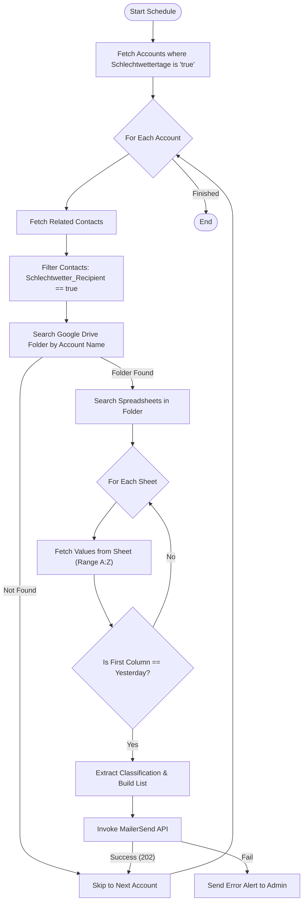

**Postman Documentation:** [Link to API Collection Placeholder]

---

## Overview
The `delugeSchlechtwettertageSchedule` is a scheduled automation script designed to identify "Bad Weather Days" (Schlechtwettertage) for specific client accounts. It scans Google Sheets stored in account-specific Google Drive folders to find data logged for the previous day. If data is found, it aggregates the classifications and dispatches a templated HTML email notification via MailerSend to designated contacts within the CRM.

## Technical Contract
- **Input:** None (Scheduled execution).
- **Output:** Void (Side effects: API calls to Google Sheets/Drive and MailerSend).
- **Primary Entities:** 
    - **Zoho CRM:** Accounts (Module), Contacts (Module).
    - **External:** Google Drive API (v3), Google Sheets API (v4), MailerSend API (v1).

## Dependency Map
This script orchestrates the following internal functions and external services:

| Function / Service | Purpose | Criticality |
| --- | --- | --- |
| Google Drive API | Locates account-specific folders and spreadsheets by name. | High |
| Google Sheets API | Retrieves raw cell data (Range A:Z) from found spreadsheets. | High |
| MailerSend API | Transmits transactional emails using template `0r83ql3q6x04zw1j`. | High |
| `googlesheets` | Zoho CRM Connection used for OAuth2 authentication with Google Services. | High |

## Logic Flow

## Core Logic Sections

### 1. Target Identification
The script filters `Accounts` using a boolean field `Schlechtwettertage`. It then retrieves associated `Contacts` and filters them for a specific recipient flag (`Schlechtwetter_Recipient`), ensuring emails are only sent to opted-in stakeholders.

### 2. Google Ecosystem Integration
The script uses the `googlesheets` connection to perform two search operations:
1.  **Folder Search:** Uses `name='[Account_Name]'` to find the directory.
2.  **File Search:** Identifies spreadsheets within that directory.
It then iterates through all spreadsheets in the folder, reading data to find rows matching `zoho.currentdate.addDay(-1)`.

### 3. Data Extraction and Filtering
It validates the "Classification" column (Index 1). It excludes rows that are empty, contain placeholders like "-", or contain the specific error string: *"Nur Teil-Daten verfügbar - Kontaktieren Sie Cordulus bei Bedarf"*. Valid entries are wrapped in HTML links to the specific sheet.

### 4. MailerSend Dispatch
Notifications are sent via a POST request to MailerSend.
- **Template ID:** `0r83ql3q6x04zw1j`
- **Dynamic Data:** Passes a list of objects containing the sheet link, classification, and date, along with a direct link to the Google Drive folder.

## Developer Notes

> [!CAUTION]
> **API Hardcoding:** The MailerSend Bearer Token is currently hardcoded in the `Authorization` header. This should be moved to a Zoho CRM Variable or a Secured Connection for security compliance.

> [!IMPORTANT]
> **Folder Naming Dependency:** The script relies on a 1:1 match between the Zoho CRM `Account_Name` and the Google Drive folder name. If the account name is changed in CRM without updating Google Drive, the script will fail to find data.

> [!WARNING]
> **Pagination Limits:** `zoho.crm.getRelatedRecords` is currently set to fetch only the first 50 contacts. If an account has more than 50 contacts, some recipients might be missed.

> [!TIP]
> The script includes a fallback mechanism: if the MailerSend API returns anything other than a `202`, it sends a separate "Script Monitor" email to `mp@cordulus.com` with the error details.

## Change Log
- **2026-03-19T17:46:03.825Z:** Initial creation of documentation via DeluluDocu. 
- **Current Version:** Implements Google Sheets v4 API and MailerSend template integration for daily bad weather reporting.