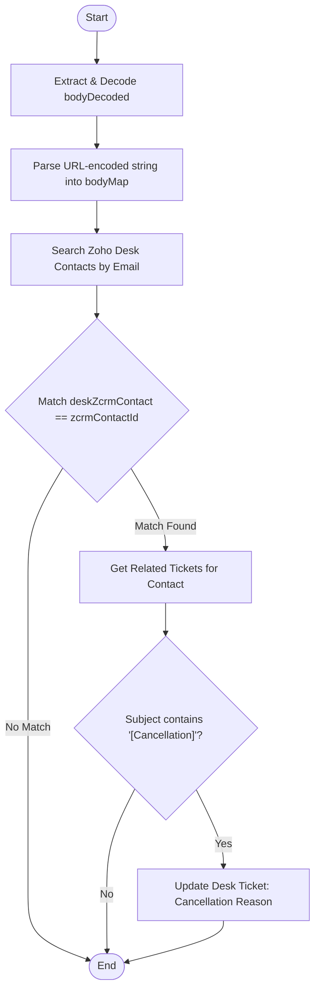

**Postman Documentation:** [Link to API Collection Placeholder]

---

## Overview
The `delugeChurnReasonUpdate` function is designed to bridge data between an external system (likely a billing platform like Chargebee or a CRM webhook) and Zoho Desk. Its primary purpose is to capture churn/cancellation feedback from an incoming request and attach it to the correct "Cancellation" ticket in Zoho Desk for a specific contact.

The script parses URL-encoded body parameters, identifies the correct Zoho Desk contact by matching the Zoho CRM Contact ID, locates a ticket with "[Cancellation]" in the subject line, and updates that ticket's "Cancellation Reason" custom field.

## Technical Contract
- **Input:** 
    - `crmAPIRequest` (String): A stringified JSON object containing the request body.
    - `body` (String): Additional body context (not actively used in primary logic as it re-extracts from `crmAPIRequest`).
- **Output:** `""` (Empty String)
- **Primary Entities:** 
    - Zoho Desk (Contacts & Tickets modules)
    - Zoho CRM (Cross-reference ID)

## Dependency Map
This script orchestrates the following internal functions and external services:

| Function / Service | Purpose | Criticality |
| --- | --- | --- |
| Zoho Desk API | Search contacts, retrieve related tickets, and update records. | High |
| Zoho Encryption | Used for `urlDecode` to process the incoming webhook payload. | High |

## Logic Flow

## Core Logic Sections

### 1. Data Normalization
The script extracts the `body` from the `crmAPIRequest` string and performs a `urlDecode`. Since the data arrives as a URL-encoded query string (e.g., `key=value&key2=value2`), it manually splits the string by `&` and `=` to construct a Deluge Map (`bodyMap`).

### 2. Desk Contact Identification
Because a single email might exist in Zoho Desk multiple times or the mapping needs to be precise, the script:
1. Searches for Desk contacts by email.
2. Iterates through the results to find a record where the `zohoCRMContact.id` matches the `contact_id` provided in the input payload.
3. Captures the specific `deskContactId`.

### 3. Ticket Filtering and Update
The script retrieves the 20 most recent tickets for the identified contact. It loops through these tickets looking for a specific string: `[Cancellation]` in the subject line. Once found, it updates the ticket with the value from `churn_feedback` provided in the original request.

## Developer Notes

> [!WARNING]
> **Hardcoded Organization ID:** The Zoho Desk Org ID `20087400249` is hardcoded multiple times. If this script is migrated to a different Zoho Desk portal, these IDs must be updated.

> [!CAUTION]
> **Lack of Error Handling:** There is no check to ensure `ticketId` was actually found before the `zoho.desk.update` call. If no cancellation ticket exists, the update call will fail or throw an error.

> [!IMPORTANT]
> **Subject String Sensitivity:** The logic relies on an exact case-sensitive match for `[Cancellation]`. If the support team changes the naming convention of cancellation tickets, this script will stop functioning.

## Change Log
- **2026-03-19T19:09:47.714Z:** Initial creation of documentation via DeluluDocu.