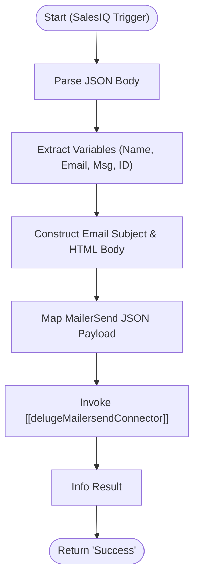

**Postman Documentation:** [Link to API Collection Placeholder]

---

## Overview
The `delugeSalesIQMissedChat` function acts as a bridge between Zoho SalesIQ and the Cordulus support team. Its primary purpose is to capture visitor data from missed or after-hours chat sessions and route them to an external email delivery service (MailerSend). This ensures that support inquiries are not lost when agents are offline, maintaining the responsiveness of the Cordulus ecosystem.

## Technical Contract
- **Input:** `crmAPIRequest` (String) - A JSON-formatted string typically provided by a SalesIQ webhook or internal trigger containing chat details.
- **Output:** `Success` (String) - Returns a hardcoded success string upon completion of the logic.
- **Primary Entities:** Zoho SalesIQ (Visitor Data), MailerSend (Email Delivery Service).

## Dependency Map
This script orchestrates the following internal functions and external services:

| Function / Service | Purpose | Criticality |
| --- | --- | --- |
| [[delugeMailersendConnector]] | Handles the POST request to the MailerSend API with the constructed payload. | High |
| MailerSend | External SMTP/API service used for reliable email delivery. | High |

## Logic Flow

## Core Logic Sections

### 1. Data Extraction & Parsing
The script expects a map-like structure within the `crmAPIRequest`. It converts the body to a Map and extracts specific SalesIQ attributes: `message`, `visitor_email`, `visitor_name`, `country`, and `chat_id`.

### 2. Content Construction
It dynamically generates an HTML email body using the extracted visitor data. This step formats the technical chat data into a readable format for support staff, including a "Chat Reference" for traceability.

### 3. MailerSend Integration
The script builds a structured Map matching the MailerSend API requirements (defining "from", "to", "subject", and "html"). It then offloads the actual HTTP execution to the [[delugeMailersendConnector]] utility function.

## Developer Notes

> [!IMPORTANT]
> This script currently returns "Success" regardless of the HTTP status returned by MailerSend. It does not contain error-handling logic for failed API calls.

> [!WARNING]
> The input `crmAPIRequest` is typed as a `String` but immediately accessed via `.get()`. This assumes the Zoho environment is automatically casting the incoming JSON string to a Map. If used in a standalone test, ensure you wrap the input in `.toMap()` first if it fails.

> [!TIP]
> To improve traceability, consider adding logic to check the `sendEmail` response and logging any errors to a "Failed Notifications" table in Zoho Creator or CRM.

## Change Log
- **2026-03-19T19:56:51.243Z:** Initial creation of documentation via DeluluDocu.