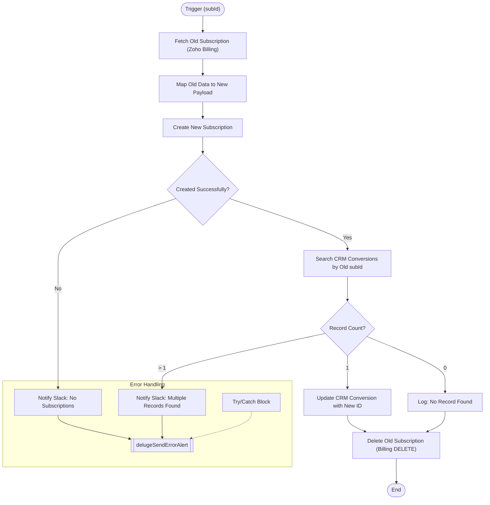

**Postman Documentation:** [Link to API Collection Placeholder]

---

## Overview
The `subscriptionResurrection` script is designed to "clone and replace" an existing subscription within Zoho Billing. It retrieves the details of an old subscription (referenced by `subId`), creates an identical new subscription, updates the corresponding record in the Zoho CRM "Conversions" module to point to the new ID, and finally deletes the original subscription. This is typically used to reset a subscription's state or fix billing discrepancies while maintaining the CRM audit trail.

## Technical Contract
- **Input:** `subId` (Int) - The unique identifier of the existing Zoho Billing subscription.
- **Output:** Void (Side-effect heavy: creates/deletes billing records and updates CRM).
- **Primary Entities:** 
    - **Zoho Billing**: Subscriptions module.
    - **Zoho CRM**: Conversions module (Custom).

## Dependency Map
This script orchestrates the following internal functions and external services:

| Function / Service | Purpose | Criticality |
| --- | --- | --- |
| [[delugePostSuccessMessageToSlack]] | Reports specific business logic failures (e.g., missing subscriptions or duplicate CRM records) to Slack. | Medium |
| [[delugeSendErrorAlert]] | Handles unexpected script exceptions and alerts development via the standard error handler. | High |
| Zoho Billing API | Used for retrieving, creating, and deleting subscription records. | High |
| Zoho CRM API | Used to search and update the "Conversions" record mapping. | High |

## Logic Flow

## Core Logic Sections

### 1. Data Retrieval and Recreation
The script first pulls the existing subscription data using `zoho.billing.retrieve`. It extracts specific fields (Customer ID, Activation Date, Plan Code, and Quantity) to construct a `newsub_payload`. Note that `auto_collect` is explicitly set to `false` for the new subscription.

### 2. CRM Link Migration
The script identifies the link between the Billing subscription and the CRM by searching the "Conversions" module for the `Subscription_ID`. 

> [!IMPORTANT]
> The script enforces a strict 1:1 relationship. If multiple conversion records are found for the same `subId`, the script terminates without updating CRM or deleting the old subscription to prevent data corruption.

### 3. Subscription Cleanup
Upon successful creation of the new subscription and updating the CRM (if applicable), the script executes a `DELETE` request via `invokeurl` against the Zoho Billing API. This uses the European endpoint (`zohoapis.eu`).

## Developer Notes

> [!WARNING]
> The `orgId` ("20087400261") is hardcoded within the script. If the organization moves to a different Zoho Billing environment or the ID changes, this script will fail.

> [!CAUTION]
> The deletion of the old subscription is permanent. Because the script uses `invokeurl` for the `DELETE` method, ensure the connection "zohobillingconnection" has sufficient scopes (`ZohoBilling.subscriptions.DELETE`).

- **Logic Edge Case**: If the new subscription is created but the CRM search fails or returns multiple records, the script exits before deleting the old subscription. This results in "orphan" duplicate subscriptions in Zoho Billing which must be cleaned up manually.

## Change Log
- **2026-03-19T19:58:16.547Z:** Initial creation of documentation via DeluluDocu.