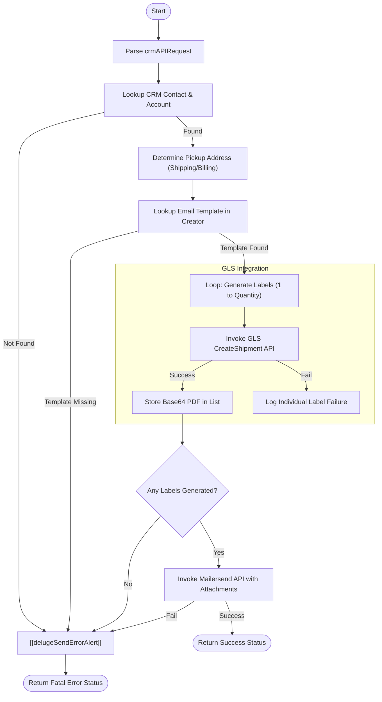

**Postman Documentation:** [Link to API Collection Placeholder]

---

## Overview
The `delugeGLSLabelHandler` is a standalone automation utility designed to generate GLS return labels and dispatch them via email to customers. It orchestrates a workflow involving Zoho CRM (for customer data), Zoho Creator (for email template mapping), the GLS API (for label generation), and Mailersend (for high-deliverability email dispatch). This function is typically triggered by a customer support action or an automated return request where a specific quantity of labels is required.

## Technical Contract
- **Input:** `crmAPIRequest` (Stringified JSON)
    - `customerId`: The Zoho CRM Contact ID.
    - `quantity`: The number of labels to generate.
- **Output:** Map containing `status`, `message`, `labels_generated`, and a list of `details` for each label attempt.
- **Primary Entities:** 
    - **Zoho CRM:** `Contacts`, `Accounts`.
    - **Zoho Creator:** `email-template-manager` (App), `TemplateMapping_Report` (Report).
    - **External Services:** GLS Shipping API, Mailersend API.

## Dependency Map
This script orchestrates the following internal functions and external services:

| Function / Service | Purpose | Criticality |
| --- | --- | --- |
| [[delugeSendErrorAlert]] | Dispatches error notifications to Slack/System Admins. | High |
| `GLS API` | External endpoint for PDF label generation. | Critical |
| `Mailersend API` | External service for transactional email delivery. | Critical |
| `Zoho Creator` | Stores the mapping between products and Mailersend template IDs. | High |

## Logic Flow

## Core Logic Sections

### 1. CRM Context & Address Extraction
The script identifies the contact and their associated account. It prioritizes the **Shipping Address** for the return pickup but falls back to the **Billing Address** if shipping details are absent. This address data is used both for the GLS label creation and to determine the "Country" context for template selection.

### 2. Dynamic Template Mapping
Rather than hardcoding email IDs, the script queries a Zoho Creator application (`email-template-manager`). It filters based on:
- `Product_Name`: "cordulus farm"
- `Event_Type`: "gls return label"
- `Country`: Extracted from the CRM Account.
This allows marketing or support teams to update templates in Creator without modifying code.

### 3. Iterative GLS Label Generation
The script loops based on the provided `quantity`. For each iteration, it performs a POST request to the GLS API. It uses hardcoded administrative credentials to authenticate and requests a PDF format return label. The Base64 string returned by GLS is stored in an `attachments_list`.

### 4. Dispatch via Mailersend
Once all labels are generated, a single API call is made to Mailersend.
- **Personalization:** Passes the customer's name and email to the template.
- **Attachments:** Attaches all successfully generated PDFs.
- **BCC:** Sends a copy to a Zoho CRM BCC parser for activity logging.

## Developer Notes

> [!WARNING]
> **Hardcoded Credentials:** The GLS API `UserName`, `Password`, `Customerid`, and `Contactid`, as well as the Mailersend `Bearer` token, are currently hardcoded in the script. These should ideally be moved to a secure Variable/Connection or an encrypted Creator record.

> [!IMPORTANT]
> **Country Codes:** The GLS payload currently uses a hardcoded `CountryNum` of `"208"` (Denmark) for both delivery and pickup. This logic will fail for international returns outside of Denmark unless updated to dynamically map CRM country strings to GLS ISO numeric codes.

> [!TIP]
> The script includes a "Master Catch Block" that ensures any unhandled exception (like a connection timeout) is still reported via `[[delugeSendErrorAlert]]` rather than failing silently.

## Change Log
- **2026-03-19T19:33:26.697Z:** Initial creation of documentation via DeluluDocu. Added logic for multi-label generation and Mailersend integration.