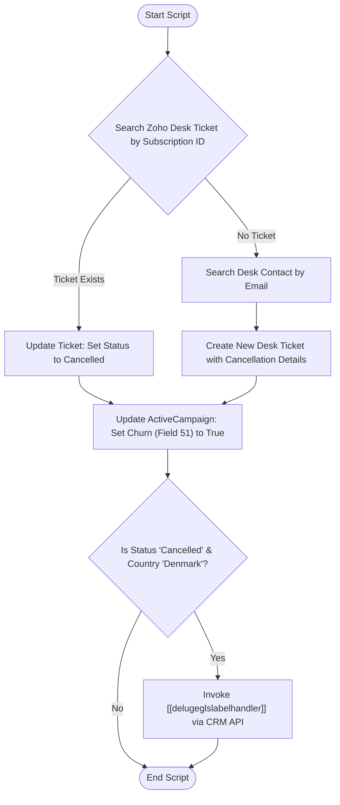

**Postman Documentation:** [Link to API Collection Placeholder]

---

## Overview
The `delugeCancellationImmediately` script is a post-cancellation automation workflow triggered when a subscription is terminated in Zoho Subscriptions. Its primary role within the Cordulus ecosystem is to synchronize the cancellation event across three critical systems: Zoho Desk (Support), ActiveCampaign (Marketing/CRM), and Zoho CRM (Logistics via GLS). It ensures support tickets are updated or created to track the churn, marks the customer as "Churned" in ActiveCampaign, and triggers a return label generation process for Danish customers.

## Technical Contract
- **Input:** 
    - `subscriptions`: Map (Zoho Subscriptions webhook payload)
    - `organization`: Map (Zoho Subscriptions organization details)
- **Output:** Side effects (Updates to Zoho Desk, ActiveCampaign, and calls to external Zoho CRM functions)
- **Primary Entities:** 
    - Zoho Subscriptions (Source)
    - Zoho Desk (Ticket management)
    - ActiveCampaign (Contact synchronization)
    - Zoho CRM (Function invocation for GLS labels)

## Dependency Map
This script orchestrates the following internal functions and external services:

| Function / Service | Purpose | Criticality |
| --- | --- | --- |
| [[delugeglslabelhandler]] | Handles the generation and sending of GLS labels for equipment returns. | High (for DK customers) |
| Zoho Desk API | Searches, updates, and creates support tickets related to cancellations. | Medium |
| ActiveCampaign API | Synchronizes the churn status to the contact record (Field 51). | Medium |

## Logic Flow

## Core Logic Sections

### 1. Zoho Desk Support Synchronization
The script first attempts to find an existing ticket in Zoho Desk linked to the specific `subscription_id` using a custom field search (`cf_subscription_id`). 
- If found, it updates the "Cancellation Status" custom field to "Cancelled". 
- If not found, it performs a secondary lookup for the contact by email and creates a new ticket containing the subscription end date and cancellation details.

### 2. ActiveCampaign Churn Tracking
To ensure marketing automation reflects the customer's status, the script performs a `contact/sync` request to ActiveCampaign. It specifically targets custom field ID `51` and sets it to `"true"`, which serves as a boolean flag for churned users.

### 3. Logistics Orchestration (GLS Labeling)
For Danish customers only, the script checks if the subscription status is explicitly "cancelled". If both conditions are met, it executes an orchestrator function in Zoho CRM (`delugeglslabelhandler`) via a POST request, passing the Zoho CRM Contact ID and the quantity of hardware (from the plan) to initiate the return shipping process.

## Developer Notes

> [!WARNING]
> This script contains several hardcoded IDs, including `zdeskOrgId` ("20087400249"), `zdeskDepartmentId` ("138065000000006907"), and the ActiveCampaign field ID ("51"). Moving these to a configuration map or Environment Variables is recommended for portability.

> [!IMPORTANT]
> The Desk ticket search relies on the custom field `cf_subscription_id`. If the API name of this field changes in Zoho Desk, the search will return no results, leading to duplicate ticket creation.

> [!TIP]
> The call to `[[delugeglslabelhandler]]` uses the `zohooauth` connection. Ensure this connection has the `ZohoCRM.functions.execute.CREATE` scope enabled.

## Change Log
- **2026-03-19T20:59:53.460Z:** Initial creation of documentation via DeluluDocu. Documented Zoho Desk search/update logic, AC sync, and GLS label logic.