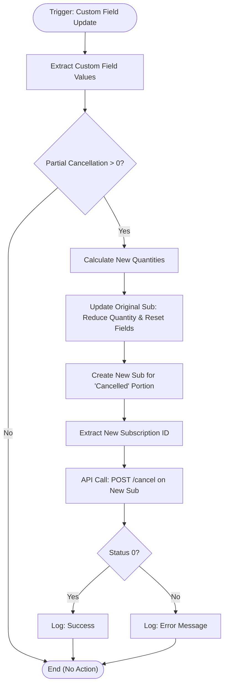

**Postman Documentation:** [Link to API Collection Placeholder]

---

## Overview
The `delugePartialCancellation` script automates the process of "Partial Cancellation" within Zoho Billing. Since Zoho Billing typically handles cancellations at the subscription level rather than the line-item quantity level, this script simulates a partial cancellation by:
1.  Reducing the quantity on the original subscription.
2.  Creating a second, temporary subscription for the "cancelled" quantity.
3.  Immediately triggering a cancellation on that second subscription.

This ensures that financial records and subscription history accurately reflect that a specific portion of a plan was terminated while the rest remains active.

## Technical Contract
- **Input:** 
    - `organization` (Map): Zoho Billing organization context.
    - `subscriptions` (Map): Data of the subscription triggering the function.
- **Output:** Side effects include updating one subscription, creating another, and calling an external API to cancel the latter.
- **Primary Entities:** 
    - Zoho Billing (Subscriptions Module)
    - Custom Fields: `Partial Cancellation`, `Partial Cancellation Time`

## Dependency Map
This script orchestrates the following internal functions and external services:

| Function / Service | Purpose | Criticality |
| --- | --- | --- |
| Zoho Billing API | Used for updating existing subscriptions and creating new ones. | High |
| `zohobilling` Connection | OAuth connection to authorize `invokeurl` and `zoho.billing` tasks. | High |

## Logic Flow

## Core Logic Sections

### 1. Field Extraction & Validation
The script iterates through the `custom_fields` list of the subscription to identify two specific keys: `Partial Cancellation` (the quantity to remove) and `Partial Cancellation Time`. It converts the cancellation value to a number and determines if the cancellation should happen at the "End of Term" based on the secondary field.

### 2. Subscription Quantity Adjustment
The script calculates the `new_quantity` by subtracting the cancellation value from the current "Cordulus Farm" line item quantity. It then uses `zoho.billing.update` to:
- Set the original subscription to the reduced quantity.
- Reset the "Partial Cancellation" custom fields to 0/null to prevent infinite loops.

### 3. The "Split and Kill" Maneuver
To maintain a paper trail of the cancellation:
- A new subscription is created using `zoho.billing.create` with the quantity that was removed from the original.
- It is backdated to the original activation date (`activated_at`).
- An `invokeurl` is sent to the Zoho Billing API's `/cancel` endpoint for this new subscription. If the user specified "End of Term", the `cancel_at_end` parameter is set to `true`.

## Developer Notes

> [!IMPORTANT]
> This script requires a valid Zoho CRM/Billing connection named `zohobilling` with sufficient scopes to update and create subscriptions (`ZohoBilling.subscriptions.UPDATE`, `ZohoBilling.subscriptions.CREATE`).

> [!WARNING]
> The script specifically looks for line items containing the string **"Cordulus Farm"**. If the plan name or line item name changes in the product catalog, the quantity extraction logic will fail.

> [!TIP]
> The logic uses `create_backdated_invoice: true`. This is crucial for ensuring that credits or adjustments are calculated correctly based on the original subscription's start date.

## Change Log
- **2026-03-19T20:59:36.693Z:** Initial creation of documentation via DeluluDocu.