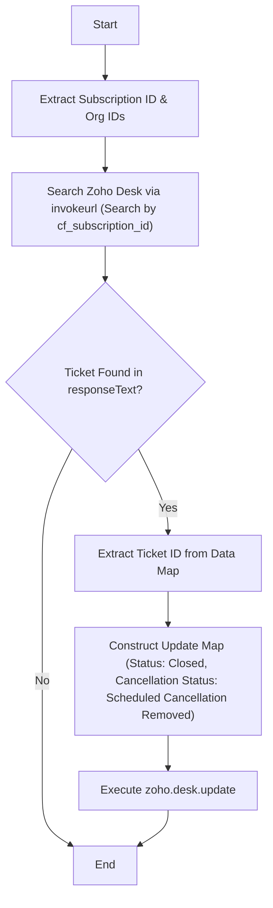

**Postman Documentation:** [Link to API Collection Placeholder]

---

## Overview
The `delugeCancellationScheduledRemoved` script is designed to automate the lifecycle of cancellation-related tickets in Zoho Desk when a scheduled cancellation is removed in Zoho Subscriptions. Its primary purpose is to find the specific support ticket associated with a customer's subscription cancellation and automatically close it, updating its internal status to reflect that the cancellation was retracted. This ensures that support staff do not act on outdated cancellation requests.

## Technical Contract
- **Input:** 
    - `organization` (Map): Global Zoho Subscriptions object containing organizational metadata.
    - `subscriptions` (Map): Global Zoho Subscriptions object containing the specific subscription details (specifically `subscription_id`).
- **Output:** Updates a Zoho Desk ticket record. Returns `info` logs of the API responses.
- **Primary Entities:** 
    - Zoho Subscriptions (Triggering Module)
    - Zoho Desk (Target Module)

## Dependency Map
This script orchestrates the following internal functions and external services:

| Function / Service | Purpose | Criticality |
| --- | --- | --- |
| Zoho Desk API (Search) | Locates the ticket linked to the subscription ID via custom fields. | High |
| Zoho Desk API (Update) | Modifies the ticket status and custom cancellation field. | High |

## Logic Flow

## Core Logic Sections

### 1. Initialization and Context Gathering
The script initializes the Desk Organization ID (`zdeskOrgId`) and extracts the `subscription_id` from the triggering subscription event. This ID is the primary key used to bridge the gap between Subscriptions and Desk.

### 2. Ticket Retrieval
Using `invokeurl`, the script performs a GET request to the Zoho Desk API search endpoint. It specifically filters for tickets where the custom field `cf_subscription_id` matches the current subscription. The search is limited to 1 result.

### 3. Ticket Closure and Status Update
If the search returns a valid ticket:
1.  The `ticketId` is extracted.
2.  A map is constructed to set the standard `status` field to "Closed".
3.  A `customFields` map is nested to update the specific "Cancellation Status" field to "Scheduled Cancellation Removed".
4.  The `zoho.desk.update` wrapper is used to commit these changes to the Desk record.

## Developer Notes

> [!IMPORTANT]
> The `zdeskOrgId` is hardcoded as `"20087400249"`. If the Zoho Desk organization changes or if this is deployed to a different environment (Sandbox vs. Production), this variable must be updated.

> [!WARNING]
> The script assumes `findTicket.get("responseText").get("data")` can be cast directly `.toMap()`. In Zoho Desk's search API, `data` is typically a List (JSON Array). If the response returns multiple or formatted differently, this may cause a runtime error.

> [!NOTE]
> The search utilizes a custom field `cf_subscription_id`. Ensure that this field is indexed in Zoho Desk and that the technical name matches the script's query parameter.

## Change Log
- **2026-03-19T21:00:20.144Z:** Initial creation of documentation via DeluluDocu.