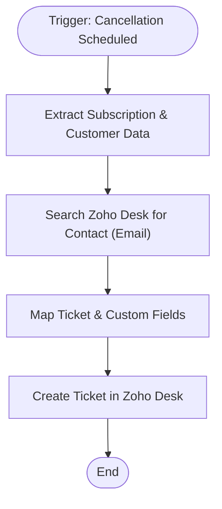

**Postman Documentation:** [Link to API Collection Placeholder]

---

## Overview
The `delugeCancellationScheduled` script is an automation triggered within the Zoho Subscriptions environment when a subscription is set to cancel at the end of the current term or on a specific scheduled date. Its primary role is to bridge the gap between Billing and Support by automatically creating a ticket in Zoho Desk. This ensures that the support team is notified of the pending churn, allowing for retention activities or administrative processing before the subscription actually expires.

## Technical Contract
- **Input:** 
    - `subscriptions`: Map containing subscription details (email, ID, cancellation dates).
    - `organization`: Map containing organization metadata.
- **Output:** Creates a record in Zoho Desk; assigns the resulting `ticketId` locally.
- **Primary Entities:** 
    - Zoho Subscriptions
    - Zoho Desk (Contacts Module)
    - Zoho Desk (Tickets Module)

## Dependency Map
This script orchestrates the following internal functions and external services:

| Function / Service | Purpose | Criticality |
| --- | --- | --- |
| [[Zoho Desk API]] | Used to search for existing contacts and create new tickets. | High |
| [[Zoho Subscriptions]] | Source of the trigger and subscription metadata. | High |

## Logic Flow
The script follows a linear path from data extraction to external record creation.

## Core Logic Sections

### 1. Data Retrieval and Contact Matching
The script extracts the customer's email from the subscription record and performs a lookup in Zoho Desk. It specifically targets the `contacts` module to ensure the ticket is associated with the correct individual.
- **Org ID:** `20087400249`
- **Department ID:** `138065000000006907`

### 2. Ticket Construction
The script builds a `createTicketMap` including:
- **Subject:** Dynamically generated string including the scheduled cancellation date.
- **Custom Fields:** Captures specific subscription metadata such as the `Subscription ID`, `Cancellation Registered Date`, and `Cancellation Effective Date`.

### 3. Desk Integration
The final stage uses `zoho.desk.create` to push the mapped data into the specified Zoho Desk department.

## Developer Notes

> [!CAUTION]
> The script contains hardcoded IDs for `zdeskOrgId` and `zdeskDepartmentId`. If the Zoho Desk organization or department structure changes, these values must be updated manually.

> [!WARNING]
> The script currently assumes that `findZdeskContact.get("data")` will always return at least one result. If a contact does not exist in Zoho Desk for the given email, the `zdeskContact.get("id")` call may return null, which could lead to an unassigned ticket or a failed creation attempt depending on Desk's mandatory field settings.

> [!TIP]
> The `Cancellation Registered Date` is cleaned using `.getPrefix("T")` to ensure only the date portion of the ISO timestamp is passed to the custom field.

## Change Log
- **2026-03-19T21:00:01.362Z:** Initial creation of documentation via DeluluDocu.