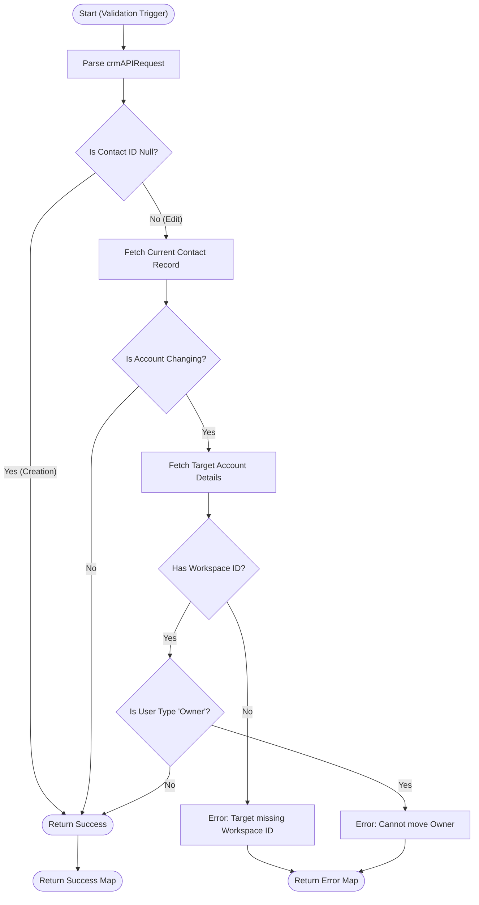

**Postman Documentation:** [Link to API Collection Placeholder]

---

## Overview
The `ownerProtection` function is a Zoho CRM Validation Rule script. Its primary purpose is to enforce business logic when a Contact is being moved from one Account to another. It prevents "Owner" type users from being reassigned to different accounts and ensures that the destination Account is properly configured with a `Kanisa_Farm_ID` (Workspace ID) before allowing the transfer.

## Technical Contract
- **Input:** `String crmAPIRequest` (A JSON string provided by Zoho CRM containing the record details during a validation trigger).
- **Output:** A Map containing `status` ("success" or "error") and an optional `message`.
- **Primary Entities:** 
    - `Contacts`
    - `Accounts`

## Dependency Map
This script orchestrates the following internal functions and external services:

| Function / Service | Purpose | Criticality |
| --- | --- | --- |
| `zoho.crm.getRecordById` | Fetches the current Contact and the target Account details. | High |

## Logic Flow

## Core Logic Sections

### 1. Request Parsing & Context Initialization
The script extracts the record ID and the submitted field values from the `crmAPIRequest`. It includes a safety check to see if the `contactId` is present to differentiate between a new record creation and an update.

### 2. Creation vs. Edit Handling
If `contactId` is null, the script assumes the record is being created for the first time. Since there is no "previous" account to compare against in a move logic context, the validation immediately returns "success".

### 3. Account Change Detection
For existing records, the script fetches the current database state of the Contact. It compares the `existingAccountId` from the database with the `targetAccountId` provided in the update request. If the Account remains the same, the script exits with success.

### 4. Destination & Role Validation
If a move is detected:
- **Workspace Validation:** The script fetches the Target Account and ensures it has a `Kanisa_Farm_ID`.
- **Role Protection:** The script checks if the `User_Type` is "Owner". Owners are restricted from changing accounts to prevent data/ownership integrity issues.

## Developer Notes

> [!IMPORTANT]
> This script performs up to two `zoho.crm.getRecordById` calls. While efficient for single record edits, ensure that bulk updates (via API) do not hit secondary governor limits if multiple validation rules are running concurrently.

> [!TIP]
> The logic includes a null check for the Contact ID. This ensures the script doesn't fail when a new Contact is being created (where the ID is not yet assigned), effectively bypassing the "move" validation during initial creation.

> [!CAUTION]
> If the `Account_Name` field is empty on the Contact (null), the `.get("id")` method on the map might throw an error. Current implementation assumes Contacts are always associated with an Account.

## Change Log
- **2026-03-19T20:13:15.887Z:** Initial creation of documentation via DeluluDocu. Enforced Owner protection and Target Account Workspace ID validation.
- **2026-03-20T08:21:17.342Z:** Added a null check for `contactId`. This prevents script errors during the creation of a new Contact, where the record ID does not yet exist in the `crmAPIRequest` payload.
- **2026-03-20T08:22:11.614Z:** Cleaned up script by removing legacy commented-out test payload from the code body to improve readability. No changes to validation logic.