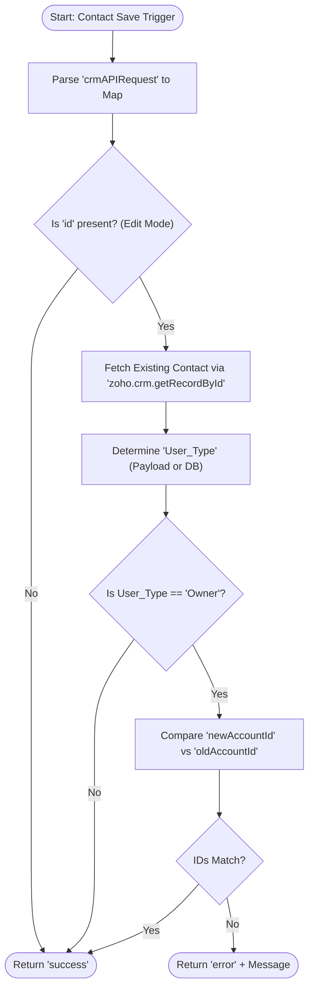

**Postman Documentation:** [Link to API Collection Placeholder]

---

## Overview
The `accountvalidation` function is a Zoho CRM Validation Rule script designed for the **Contacts** module. Its primary purpose is to enforce data integrity by preventing users from moving a Contact to a different Account if that Contact's "User Role" is set to "Owner". This ensures that primary account stakeholders remain associated with their respective organizations unless their role is changed first.

## Technical Contract
- **Input:** `String crmAPIRequest` (A JSON string provided by Zoho CRM containing the record details being saved).
- **Output:** `Map` (Contains `status` as "success" or "error", and an optional "message" for UI display).
- **Primary Entities:** 
    - `Contacts`
    - `Accounts` (Lookup Relationship)

## Dependency Map
This script orchestrates the following internal functions and external services:

| Function / Service | Purpose | Criticality |
| --- | --- | --- |
| `zoho.crm.getRecordById` | Fetches the current state of the Contact from the database to compare against incoming changes. | High |

## Logic Flow

## Core Logic Sections

### 1. Payload Parsing & Context Identification
The script converts the `crmAPIRequest` string into a Deluge Map. It checks for the existence of a record ID to distinguish between a new record creation and an update to an existing record.

### 2. State Comparison (Database vs. Request)
To identify if the "Account Name" field is being modified, the script performs a `zoho.crm.getRecordById` call. This is necessary because the `crmAPIRequest` only reliably contains the fields being changed or specifically sent in the context, whereas the validation logic requires knowing the original Account ID.

### 3. Business Rule Enforcement
The core logic evaluates the `User_Type`. If the role is "Owner", it extracts the ID from the lookup maps (`Account_Name`). If the incoming ID does not match the stored ID, the script returns an error map, which triggers the Zoho CRM UI to block the save and display the validation message.

## Developer Notes

> [!IMPORTANT]
> This script specifically targets the "Owner" value in the `User_Type` field. If the picklist values in CRM are modified (e.g., renamed to "Account Owner"), this script will bypass validation and must be updated.

> [!NOTE]
> Lookup fields in the `crmAPIRequest` are structured as Maps (e.g., `{"name": "...", "id": "..."}`). The script uses `.get("id")` to ensure comparison is done on the unique 19-digit identifier rather than the display name.

> [!TIP]
> This script is optimized for "Edit" scenarios. During "Create" scenarios (where `id` is null), the validation is skipped, allowing Owners to be assigned to any account initially.

## Change Log
- **2026-03-19T19:40:24.653Z:** Initial creation of documentation via DeluluDocu.