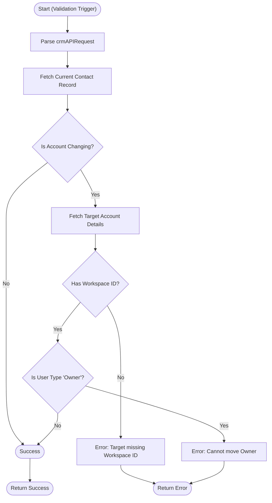

**Postman Documentation:** [Link to API Collection Placeholder]

---

## Overview
The `ownerProtection` function is a Zoho CRM Validation Rule script. Its primary purpose is to enforce business logic when a Contact is being moved from one Account to another. It prevents "Owner" type users from being reassigned to different accounts and ensures that the destination Account is properly configured with a `Kanisa_Farm_ID` (Workspace ID) before allowing the transfer.

## Technical Contract
- **Input:** `String crmAPIRequest` (A JSON string provided by Zoho CRM containing the record details during a validation trigger).
- **Output:** A Map containing `status` ("success" or "error") and an optional `message`.
- **Primary Entities:** 
    - `Contacts`
    - `Accounts`

## Dependency Map
This script orchestrates the following internal functions and external services:

| Function / Service | Purpose | Criticality |
| --- | --- | --- |
| `zoho.crm.getRecordById` | Fetches the current Contact and the target Account details. | High |

## Logic Flow

## Core Logic Sections

### 1. Request Parsing & Context Initialization
The script extracts the record ID and the submitted field values (like `User_Type` and the new `Account_Name`) from the `crmAPIRequest`. It then performs a lookup on the existing Contact record to determine the original `existingAccountId` for comparison.

### 2. Account Change Detection
The validation logic only executes if the `existingAccountId` (from the database) differs from the `targetAccountId` (the value being saved). If the Account remains the same, the script returns "success" immediately.

### 3. Destination Validation
If a move is detected, the script fetches the Target Account. It enforces a strict requirement that the destination Account must have a value in the `Kanisa_Farm_ID` field. This prevents Contacts from being moved into "unprovisioned" or orphaned accounts.

### 4. Role-Based Protection
The script checks the `User_Type` of the Contact. If the user is flagged as an "Owner", the move is blocked. This is a security measure to ensure account ownership structures remain intact within the Kanisa Farm ecosystem.

## Developer Notes

> [!IMPORTANT]
> This script performs up to two `getRecordById` calls. While efficient for single record edits, ensure that bulk updates (via API) do not hit secondary governor limits if multiple validation rules are running concurrently.

> [!TIP]
> This function specifically targets the "Populace" user logic. If a user needs to be moved despite being an "Owner", their `User_Type` must be downgraded before the Account change is attempted.

> [!CAUTION]
> If the `Account_Name` field is empty on the Contact (null), the `.get("id")` method on the map might throw an error. Current implementation assumes Contacts are always associated with an Account.

## Change Log
- **2026-03-19T20:13:15.887Z:** Initial creation of documentation via DeluluDocu. Enforced Owner protection and Target Account Workspace ID validation.