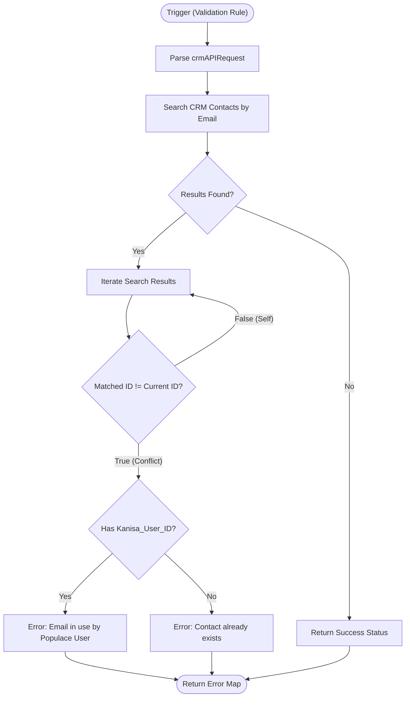

**Postman Documentation:** [Link to API Collection Placeholder]

---

## Overview
This function serves as a **Validation Rule** script within Zoho CRM for the **Contacts** module. Its primary purpose is to enforce email uniqueness across the database before a record is saved or updated. 

It specifically checks if an email address is already assigned to a different Contact record. If a conflict is found, it further distinguishes whether the existing contact is a "Populace" user (indicated by the presence of a `Kanisa_User_ID`), providing a specific error message to the user to prevent duplicate account creation or data corruption within the Cordulus/Populace ecosystem.

## Technical Contract
- **Input:** `crmAPIRequest` (String) - A JSON string provided by Zoho CRM's validation rule engine containing the record's current field values.
- **Output:** `Map` - A response map containing `status` ("success" or "error") and a `message`.
- **Primary Entities:** 
    - `Contacts` (Zoho CRM Module)

## Dependency Map
This script orchestrates the following internal functions and external services:

| Function / Service | Purpose | Criticality |
| --- | --- | --- |
| `zoho.crm.searchRecords` | Searches for existing contacts with the same email address. | High |

## Logic Flow

## Core Logic Sections

### 1. Request Parsing & Initialization
The script converts the `crmAPIRequest` string into a map to extract the `Email` and the unique `id` of the record being processed. It initializes a default "success" response to allow the save operation to proceed unless a conflict is explicitly found.

### 2. Duplicate Lookup
A `zoho.crm.searchRecords` call is executed using the `(Email:equals:...)` criteria. This ensures that the check is exact and case-insensitive based on Zoho CRM's standard search indexing.

### 3. Conflict Validation & Messaging
The script iterates through any search results. It ignores the record itself (if the `id` matches) to allow updates to existing records. 
- If a different ID is found, it checks for a `Kanisa_User_ID`.
- If a `Kanisa_User_ID` exists, it triggers a specific error message highlighting that the email is already in use by a "Populace User."
- Otherwise, it returns a generic duplicate email error.

## Developer Notes

> [!IMPORTANT]
> This script is designed to run as a **Validation Rule**. If the CRM search fails or times out, the validation might be bypassed depending on Zoho's internal execution limits.

> [!WARNING]
> The script contains commented-out hardcoded values used for testing. Ensure these remain commented out in production environments to avoid validating against the wrong data.

> [!TIP]
> The use of `.trim()` on the email input is a best practice implemented here to prevent false negatives caused by accidental whitespace during data entry.

## Change Log
- **2026-03-19T18:52:34.126Z:** Initial creation of documentation via DeluluDocu. Documented the logic for handling Kanisa/Populace User ID conflicts.