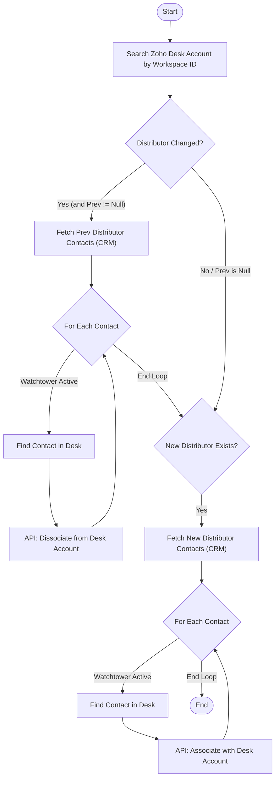

**Postman Documentation:** [Link to API Collection Placeholder]

---

## Overview
The `delugeWAT02` function manages the relationship between Distributor contacts and Customer accounts within Zoho Desk. It is triggered when a Customer's Distributor changes in Zoho CRM. The script ensures that "Watchtower" active contacts from the previous distributor lose access to the customer's Desk account, while contacts from the newly assigned distributor gain access (with the ability to view account tickets).

## Technical Contract
- **Input:** 
    - `String workspace_id`: The unique identifier for the customer workspace.
    - `String previous_values`: A JSON string/map containing the prior state of the record (specifically looking for `Distributor_Lookup`).
    - `Int distributor_account_id`: The ID of the currently assigned Distributor Account in Zoho CRM.
- **Output:** None (Side effects: Zoho Desk API calls to associate/dissociate records).
- **Primary Entities:** 
    - Zoho CRM (Accounts, Contacts)
    - Zoho Desk (Accounts, Contacts)

## Dependency Map
This script orchestrates the following internal functions and external services:

| Function / Service | Purpose | Criticality |
| --- | --- | --- |
| Zoho Desk API | Searching for Accounts/Contacts and managing associations via `invokeurl`. | High |
| Zoho CRM Service | Fetching related contacts for Distributor accounts. | High |

## Logic Flow

## Core Logic Sections

### 1. Customer Identification
The script identifies the target Customer Account in Zoho Desk by searching the `customField1` field for the string `"Workspace ID:" + workspace_id`. This establishes the Desk Account ID required for all subsequent association operations.

### 2. Dissociation of Previous Distributor
If the Distributor lookup has changed and a previous distributor existed, the script:
- Retrieves all contacts related to the previous Distributor CRM Account.
- Filters for contacts where the field `Watchtower` is set to "Active".
- Resolves the Contact's Desk ID via their `Kanisa_User_ID`.
- Calls the Zoho Desk `dissociateAccounts` endpoint to remove the link between that contact and the customer's desk account.

### 3. Association of New Distributor
Regardless of whether a dissociation occurred, if a new Distributor is assigned:
- It fetches the new Distributor's contacts from CRM.
- For each "Watchtower Active" contact, it resolves their Desk ID.
- Calls the Zoho Desk `associateAccounts` endpoint, specifically setting `isAccountTicketsViewable` to `true`.

## Developer Notes

> [!WARNING]
> The script contains a hardcoded `zdesk_org_id = "20087400249"`. If the Zoho Desk organization changes or the script is migrated to a different environment, this value must be updated.

> [!IMPORTANT]
> The search logic for Desk Contacts relies on `customField1` containing the string `"User ID:" + distributor_zcrm_contact_user_id`. Consistency in how data is synced to Desk custom fields is critical for this script's success.

> [!NOTE]
> The API calls use `detailed:true` in `invokeurl`, allowing for response code checking (e.g., `if(response_code == 200)`). However, currently, the script only logs info and does not perform retry logic or error handling for 4xx/5xx responses.

## Change Log
- **2026-03-19T19:33:06.460Z:** Initial creation of documentation via DeluluDocu.