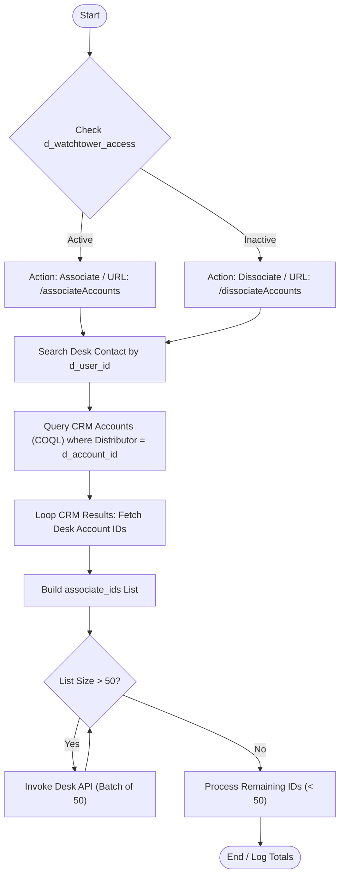

**Postman Documentation:** [Link to API Collection Placeholder]

---

## Overview
The `delugeWAT03` script is responsible for synchronizing access rights between a Distributor's Contact and multiple customer Accounts within Zoho Desk. Triggered by a status change in "Watchtower Access," the script identifies all customer accounts associated with a specific distributor in Zoho CRM and then performs a bulk association or dissociation of those accounts to the Distributor's record in Zoho Desk. This ensures that distributors can only see the tickets and data for customers they are currently authorized to monitor.

## Technical Contract
- **Input:** 
    - `Int d_contact_id`: The ID of the contact record.
    - `Int d_account_id`: The CRM ID of the Distributor's Account.
    - `String d_user_id`: The unique User ID used for searching Desk contacts.
    - `String d_watchtower_access`: The status determining the action ("Active" or "Inactive").
- **Output:** `void` (Side effects: Updates Zoho Desk associations via API).
- **Primary Entities:** 
    - Zoho Desk (Contacts & Accounts)
    - Zoho CRM (Accounts)

## Dependency Map
This script orchestrates the following internal functions and external services:

| Function / Service | Purpose | Criticality |
| --- | --- | --- |
| Zoho CRM COQL API | Fetches all customer accounts linked to the distributor using a SQL-like query. | High |
| Zoho Desk API | Performs the bulk association/dissociation of account IDs. | High |
| `zoho.desk.searchRecords` | Locates the technical IDs for Contacts and Accounts in the Desk environment. | High |

## Logic Flow

## Core Logic Sections

### 1. Action State Configuration
The script first evaluates `d_watchtower_access`. If "Active", it prepares for an association request; if "Inactive", it prepares for dissociation. This determines the endpoint suffix used later in the `invokeurl` call.

### 2. Cross-Platform Identity Mapping
The script bridges Zoho CRM and Zoho Desk. It searches Zoho Desk for a contact record where `customField1` matches the `d_user_id`. It then queries CRM via COQL to find all Account records where `Distributor_Lookup` matches the provided `d_account_id` and `Legacy_Weather` is true.

### 3. Desk Account Discovery
For every CRM account found, the script performs a Desk search to find the corresponding Desk Account ID based on the `Kanisa_Farm_ID`. These IDs are aggregated into a list.

### 4. Batched API Execution
To comply with Zoho Desk API limitations regarding the number of IDs processed in a single request, the script implements a manual chunking mechanism. It iterates through the gathered IDs and triggers a POST request for every 50 records, followed by a final request for any remaining IDs.

## Developer Notes

> [!IMPORTANT]
> The script uses a hardcoded Zoho Desk Org ID: `20087400249`. If the organization is migrated or the ID changes, this value must be updated.

> [!CAUTION]
> The COQL query is limited to `2000` records. If a distributor has more than 2,000 customer accounts, the script will not process records beyond the first 2,000.

> [!TIP]
> The script uses `detailed: true` in `invokeurl`. This is excellent for debugging because it returns the full response object, including HTTP status codes, which are logged to the Info console.

## Change Log
- **2026-03-19T19:34:10.303Z:** Initial creation of documentation via DeluluDocu. 
- **Summary:** Script implemented to handle bulk account visibility for distributors in Zoho Desk using COQL and batch processing.