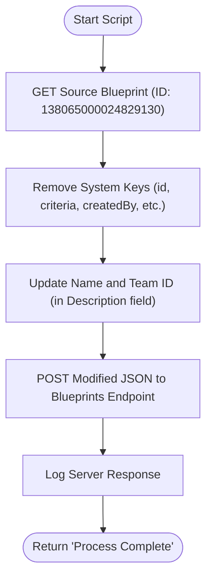

**Postman Documentation:** [Link to API Collection Placeholder]

---

## Overview
The `delugeDuplicateBlueprint` function is a standalone utility designed to clone an existing Zoho Desk Blueprint. It automates the process of fetching a source blueprint's configuration, sanitizing the JSON payload by removing read-only or system-generated fields, and re-submitting it as a new blueprint entry. This is particularly useful for migrating complex workflows between departments or duplicating templates for different teams within Zoho Desk.

## Technical Contract
- **Input:** None (Standalone function)
- **Output:** `string` (Status message: "Process Complete")
- **Primary Entities:** 
    - Zoho Desk Blueprints API
    - `zohodesk` OAuth Connection

## Dependency Map
This script orchestrates the following internal functions and external services:

| Function / Service | Purpose | Criticality |
| --- | --- | --- |
| Zoho Desk API (v1) | Provides endpoints for fetching and creating blueprints. | High |
| `zohodesk` Connection | Handles OAuth authentication for API calls. | High |

## Logic Flow

## Core Logic Sections

### 1. Source Extraction
The script initiates a `GET` request to the Zoho Desk API to retrieve the full JSON configuration of a specific blueprint. This includes transitions, states, and configuration settings.

### 2. Payload Sanitization
To successfully `POST` a new blueprint based on an existing one, the script must remove keys that are unique to the source instance or managed by the system. The script strips:
- `id`, `criteria`, `orderNumber`, `layout`
- Audit fields: `createdBy`, `createdTimeInMillis`, `modifiedBy`, `modifiedTimeInMillis`
- Status flags: `draft`

### 3. Identity Update
The script modifies the metadata of the blueprint to distinguish the clone from the original:
- Sets a new `name`: "Watchtower: Sributor, Inc Blueprint".
- Stores a specific Team ID (`138065000029751051`) within the `description` field for organizational mapping.

### 4. Instantiation
The sanitized and updated Map is converted to a string and sent via a `POST` request to the base blueprints endpoint.

## Developer Notes

> [!WARNING]
> This script contains hardcoded IDs for the source Blueprint and the Target Team. These should be parameterized if this function is intended for multi-tenant or multi-blueprint use.

> [!IMPORTANT]
> The `zohodesk` connection must have sufficient scopes (`Desk.settings.ALL` or `Desk.settings.WRITE`) to interact with the Blueprints API.

> [!TIP]
> To duplicate a blueprint to a different department, uncomment the `departmentId` lines in the script and provide the target Department ID.

## Change Log
- **2026-03-19T20:28:52.762Z:** Initial creation of documentation via DeluluDocu.