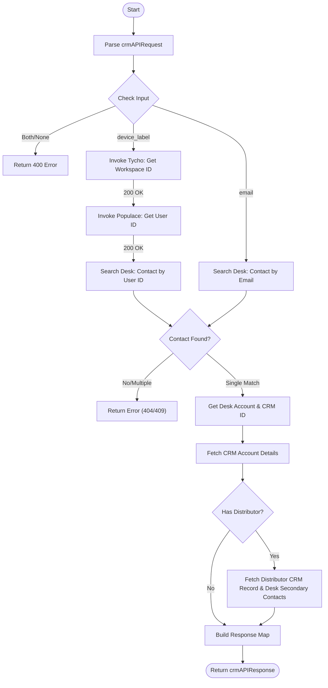

**Postman Documentation:** [Link to API Collection Placeholder]

---

## Overview
This script serves as a backend identity resolution service for the Cordulus development environment. It accepts either a hardware `device_label` or a user `email` and performs a multi-stage lookup across internal microservices (Tycho, Populace) and Zoho platforms (Desk, CRM). Its primary role is to bridge the gap between physical device identifiers and the corresponding Zoho CRM Account, Zoho Desk Contact, and Distributor information required for support and provisioning workflows.

## Technical Contract
- **Input:** `String crmAPIRequest` (A JSON string containing a `body` map with either `device_label` or `email`).
- **Output:** A JSON map structured for `crmAPIResponse`, containing nested maps for `contact`, `account`, and `distributor` details.
- **Primary Entities:** 
    - **Tycho (Internal):** Resolves device labels to Workspaces.
    - **Populace (Internal):** Resolves Workspaces to User IDs.
    - **Zoho Desk:** Source for Contact and Account association.
    - **Zoho CRM:** Source for detailed Account attributes and Distributor mappings.

## Dependency Map
This script orchestrates the following internal functions and external services:

| Function / Service | Purpose | Criticality |
| --- | --- | --- |
| Tycho API (`tychodev`) | Resolves `device_label` to a `workspaceId`. | High |
| Populace API (`populacedev`) | Resolves `workspaceId` to a `userId`. | High |
| Zoho Desk API | Searches for Contact records and retrieves associated Account data. | High |
| Zoho CRM API | Retrieves extended Account details and Distributor lookup information. | High |

## Logic Flow

## Core Logic Sections

### 1. Input Validation
The script strictly enforces an "exclusive or" logic for inputs. It expects a JSON body containing either `device_label` or `email`. If both are provided or both are missing, it returns a 400 Bad Request.

### 2. Identity Resolution (Tycho & Populace)
If a `device_label` is provided:
- It queries the **Tycho** service to find the owner's `workspaceId`.
- It then queries the **Populace** service to find the `userId` associated with that workspace.
- This `userId` is used as a foreign key in Zoho Desk.

### 3. Zoho Desk Contact Search
The script searches Zoho Desk for a contact record. 
- When searching by `userId`, it filters by `customField1` (User ID) and `customField2=dev:true`.
- When searching by `email`, it filters by the email address and `customField2=dev:true`.
- Logic includes strict error handling for 0 or >1 matches to ensure data integrity.

### 4. CRM Enrichment & Distributor Lookup
Once a Desk Contact is found, the script retrieves the associated Desk Account. It then uses the `zohoCRMAccount.id` link to pull data from Zoho CRM:
- Retrieves `Kanisa_Farm_ID`.
- Checks for a `Distributor_Lookup`.
- If a distributor exists, it fetches the distributor's specific ID and Team ID.
- It performs a secondary Desk API call to the Account's contacts list to identify a contact with the mapping type `SECONDARY`, designated as the `distributorContactId`.

## Developer Notes

> [!IMPORTANT]
> This script is specifically configured for the **Development** environment. It uses `.dev` endpoints for Tycho and Populace, and filters Zoho Desk records where `customField2` is set to `true` (representing a 'dev' flag).

> [!WARNING]
> The search logic for `SECONDARY` contacts in Zoho Desk assumes that only one such contact exists per account. If multiple secondary contacts exist, the script will return the ID of the last one processed in the loop.

> [!TIP]
> The `org_id` (20087400249) is hardcoded at the top of the script. If the Zoho Desk organization changes or the script is migrated to Production, this value must be updated.

## Change Log
- **2026-03-19T18:57:19.331Z:** Initial creation of documentation via DeluluDocu. 
- **2026-03-19:** Implemented secondary contact lookup to identify Distributor contact IDs.
- **2026-03-19:** Added error handling for multiple contact matches (409 Conflict).