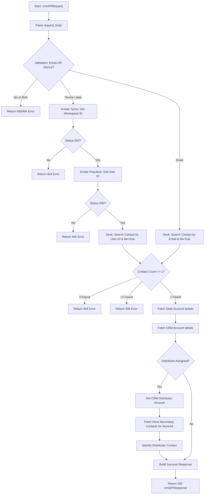

# Deluge: Get Zoho IDs From Device or Email (Dev)

## Description
This script retrieves a comprehensive set of Zoho Desk and Zoho CRM identifiers, account details, and distributor information for a user. It accepts either a `device_label` (which triggers a lookup chain through Tycho and Populace) or a direct `email` address. The script is specifically configured for development/test environments, filtering Desk contacts with a `dev:true` custom field.

## Dependency Map
### Dependencies
*   None

### Functions Called
*   None

## Logic Flow

## Developer Notes
- [!IMPORTANT]
  The script enforces a strict "one or the other" rule for inputs. Providing both `email` and `device_label` or providing neither will result in a 404 validation error.
- [!NOTE]
  This script uses three distinct external connections: `tychodev`, `populacedev`, and `zohooauth`.
- [!SUCCESS]
  The script filters Zoho Desk contacts using `customField2=dev:true`. This ensures that production data is not inadvertently targeted during development testing.
- The distributor lookup logic specifically searches for a contact with the mapping type `SECONDARY` within the Desk Account to identify the distributor's representative.
- The CRM Account lookup utilizes the `Kanisa_Farm_ID` field as the Workspace ID reference.

## Change Log
| Timestamp | Change Description |
| :--- | :--- |
| 2026-03-19T14:09:33.993Z | Initial documentation of the development script. Implemented multi-service lookup (Tycho/Populace/Desk/CRM) to resolve IDs and distributor relationships. |