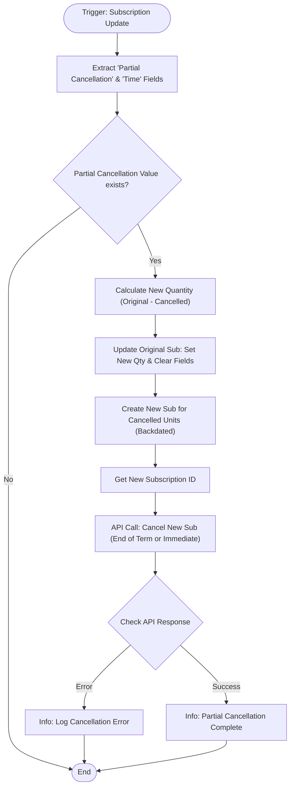

**Postman Documentation:** [Link to API Collection Placeholder]

---

## Overview
The **Partial Cancellation** script is designed to handle scenarios where a customer wants to cancel only a portion of their subscription (e.g., reducing the number of licenses or units) rather than the entire contract. 

Within the Cordulus ecosystem, this script automates the "splitting" of a subscription:
1. It reduces the quantity on the original subscription.
2. It creates a secondary "ghost" subscription for the cancelled units.
3. It immediately cancels the secondary subscription to ensure revenue recognition and churn are tracked accurately for the specific units being removed.

## Technical Contract
- **Input:** 
    - `subscriptions` (Map): The context map containing subscription details.
    - `organization` (Map): The organization context.
- **Output:** Side effects including one updated subscription and one created/cancelled subscription.
- **Primary Entities:** 
    - Zoho Billing (Subscriptions)
    - Custom Fields: `Partial Cancellation`, `Partial Cancellation Time`

## Dependency Map
This script orchestrates the following internal functions and external services:

| Function / Service | Purpose | Criticality |
| --- | --- | --- |
| `zoho.billing.update` | Reduces quantity on the primary subscription record. | High |
| `zoho.billing.create` | Creates a temporary subscription record for the cancelled units. | High |
| Zoho Billing API (`/cancel`) | Terminates the newly created subscription via `invokeurl`. | High |

## Logic Flow

## Core Logic Sections

### 1. Custom Field Extraction
The script iterates through the `custom_fields` list to find two specific keys: `Partial Cancellation` (the quantity to be removed) and `Partial Cancellation Time` (determining if the cancellation happens immediately or at the end of the term).

### 2. Original Subscription Adjustment
The script identifies the line item containing "Cordulus Farm", calculates the remaining quantity, and performs a `zoho.billing.update`. Crucially, it resets the `Partial Cancellation` fields on the original record to `0`/`null` to prevent re-triggering or stale data.

### 3. Ghost Subscription Creation
A new subscription is created for the customer using the same `plan_code`. 
- `quantity`: Set to the `partial_cancellation_value`.
- `starts_at`: Set to the original subscription's `activated_at` date.
- `notes`: Tagged with `[SYSTEM NOTE] PARTIAL CANCELLATION` for audit trails.

### 4. Automated Cancellation
Using `invokeurl`, the script calls the Zoho Billing v1 API. It passes the `cancel_at_end` parameter (a boolean) derived from the `Partial Cancellation Time` field. This ensures that the portion being "removed" respects the customer's contract terms regarding the cancellation date.

## Developer Notes

> [!WARNING]
> The `invokeurl` is hardcoded to `https://www.zohoapis.eu/billing/v1/...`. If this script is deployed in an organization residing in a different data center (e.g., .com, .in, .com.au), the URL must be updated accordingly.

> [!IMPORTANT]
> The script relies on the string "Cordulus Farm" being present in the line item name to identify the primary quantity. If the plan name or line item description changes, the `quantity` calculation will fail.

> [!TIP]
> This "Split-and-Cancel" logic is necessary because Zoho Billing does not natively support "Partial Cancellations" with distinct termination dates for specific units within a single subscription record.

## Change Log
- **2026-03-19T20:55:17.384Z:** Initial creation of documentation via DeluluDocu.