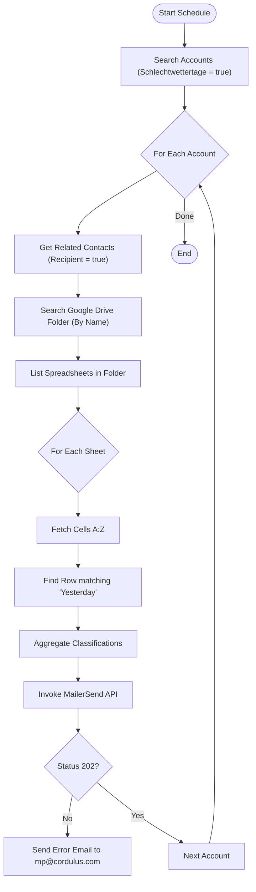

**Postman Documentation:** [Link to API Collection Placeholder]

---

## Overview
The `delugeSchlechtwettertageSchedule` is a scheduled automation designed to monitor and report "Bad Weather Days" (Schlechtwettertage) for specific client accounts. It identifies accounts opted into this service, retrieves relevant weather data stored in Google Sheets (hosted on a client-specific Google Drive folder), and dispatches a personalized summary email via MailerSend to designated contacts.

## Technical Contract
- **Input:** None (Scheduled Trigger)
- **Output:** Side effects: Dispatches transactional emails via MailerSend API to CRM Contacts.
- **Primary Entities:** 
    - **Zoho CRM:** Accounts, Contacts
    - **Google Drive API:** Folder/File discovery
    - **Google Sheets API:** Data extraction
    - **MailerSend:** External Email Service provider

## Dependency Map
This script orchestrates the following internal functions and external services:

| Function / Service | Purpose | Criticality |
| --- | --- | --- |
| Google Drive API | Search for folders matching Account Names and identifying spreadsheets. | High |
| Google Sheets API | Reading daily weather classification data from specific rows. | High |
| MailerSend API | Delivering the final notification to the client and error alerts to admins. | High |
| `googlesheets` | Zoho Connection used for Google OAuth 2.0 authentication. | High |

## Logic Flow

## Core Logic Sections

### 1. Target Identification
The script filters CRM Accounts where the custom field `Schlechtwettertage` is enabled. It then retrieves related Contacts specifically marked as `Schlechtwetter_Recipient` to build the mailing list.

### 2. Google Workspace Integration
The script utilizes a specific naming convention: it searches Google Drive for a folder whose name **exactly matches** the CRM `Account_Name`. Inside this folder, it iterates through all Google Sheets to find rows where Column A matches "yesterday's" date (`yyyy-MM-dd`).

### 3. Data Parsing & Filtering
It looks for a classification in the second column (Column B). It ignores placeholder text such as "Nur Teil-Daten verfügbar..." or empty/hyphen values to ensure only valid weather data triggers a count increment.

### 4. Email Dispatch (MailerSend)
The script uses `invokeurl` to communicate with the MailerSend API.
- **Template ID:** `0r83ql3q6x04zw1j`
- **Personalization:** Passes a list of links and classifications to the template.
- **Error Handling:** If the API returns anything other than a `202`, it sends a high-priority HTML error log to the system administrator.

## Developer Notes

> [!WARNING]
> **API Key Exposure:** The MailerSend Bearer Token is currently hardcoded in the `headers` map. This should ideally be moved to a Zoho CRM Organization Variable or an encrypted Secret Store.

> [!CAUTION]
> **Naming Dependency:** The script relies on the Google Drive folder name being identical to the Zoho CRM Account Name. Any renaming in either system without a corresponding change in the other will break the lookup logic for that account.

> [!IMPORTANT]
> **Rate Limiting:** If the number of accounts or sheets grows significantly, the script may exceed the Zoho Deluge execution time limit (5-10 minutes) or hit Google API rate limits due to multiple `invokeurl` calls inside nested loops.

## Change Log
- **2026-03-19T17:43:18.179Z:** Initial creation of documentation via DeluluDocu.