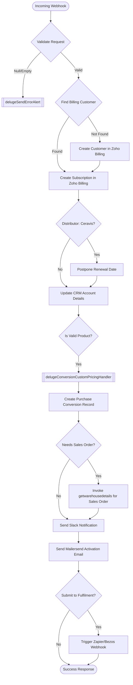

**Postman Documentation:** [Link to API Collection Placeholder]

---

## Overview
The `delugeSubscriptionHandler` is a central orchestration script designed to process incoming webhook requests for new subscriptions. It manages the end-to-end lifecycle of a new sale: from customer creation and subscription provisioning in Zoho Billing, to CRM account updates, record creation in a custom "Conversions" module, optional Sales Order generation in Zoho Inventory, and automated notifications via Slack and Mailersend.

## Technical Contract
- **Input:** `String crmAPIRequest` (A JSON string containing customer, product, and distributor details).
- **Output:** A JSON string containing a `status_code` (200 for success, 500 for failure) and a descriptive `message`.
- **Primary Entities:** Zoho Billing, Zoho CRM (Accounts, Conversions), Zoho Inventory (Sales Orders), Slack, Mailersend.

## Dependency Map
This script orchestrates the following internal functions and external services:

| Function / Service | Purpose | Criticality |
| --- | --- | --- |
| [[delugeSendErrorAlert]] | Logs errors and sends alerts to developers if execution fails. | High |
| [[delugeConversionCustomPricingHandler]] | Calculates custom pricing logic for products and addons during conversion. | Medium |
| [[getwarehousedetails]] | External CRM function called via API to generate Sales Orders in Inventory. | Medium |
| Zoho Billing API | Used to manage customers and create subscriptions. | High |
| Mailersend API | Sends transactional confirmation emails to internal staff and distributors. | Low |
| Slack API | Sends real-time notifications to the sales team. | Low |

## Logic Flow

## Core Logic Sections

### 1. Validation and Data Extraction
The script first validates that `crmAPIRequest` is not null and contains a body. It then extracts nearly 40 variables including customer contact info, address details, product IDs, and distributor metadata.

### 2. Zoho Billing Integration
It searches for an existing customer in Zoho Billing via email. If missing, it creates a new customer profile. It then creates a subscription using the provided `subscriptionPlanCode`. There is specific logic for the distributor **Ceravis AG** to automatically postpone the first renewal to the beginning of the next calendar year if the start date is not in January.

### 3. CRM Account Synchronization
The script updates the linked Zoho CRM Account with the most recent VAT number, distributor information, and shipping/billing addresses provided in the request.

### 4. Purchase Conversions & Custom Pricing
If the product belongs to the "Cordulus Farm" or "SectorWeather" families (and is not a test plan), the script calls `[[delugeConversionCustomPricingHandler]]` to handle line-item overrides. It then creates a record in the **Conversions** module to track the sale.

### 5. Inventory & Fulfilment
For hardware-based products, the script makes an authenticated call to an external CRM function (`getwarehousedetails`) which acts as a bridge to Zoho Inventory to generate a Sales Order. If the `submitToFulfilment` flag is set, it also triggers a Zapier webhook for third-party logistics (Bezos).

### 6. Automated Communications
- **Slack:** Posts a detailed summary of the activation to a specific channel (C05FE829H0B).
- **Mailersend:** Sends a template-based email (`351ndgwn3qgzqx8k`) to the seller, CC'ing the distributor and Cordulus info mail.

## Developer Notes
- [!WARNING]
    > The script contains a hardcoded API key (`zapikey`) in the URL for the `getwarehousedetails` function call. This should be moved to a secure variable or Connection if possible.
- [!IMPORTANT]
    > The Layout ID for the Conversions module (`520877000144985005`) is hardcoded. If the CRM layout is deleted or changed, this will cause the script to fail at Step 6.
- **Edge Case:** The script explicitly skips Slack notifications for "Cropline" products to avoid channel noise.
- **Error Handling:** The script uses a global `try-catch` block. Any critical failure in the first 4 steps (Billing/Subscription) returns an error immediately, whereas failures in CRM updates or notifications are logged as warnings but allow the process to finish.

## Change Log
- **2026-03-19T14:11:44.667Z:** Initial creation of documentation via DeluluDocu.