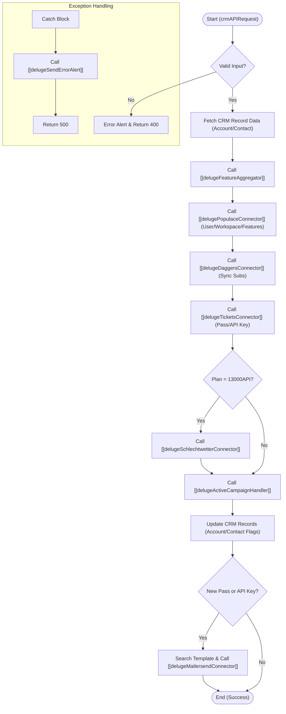

**Postman Documentation:** [Link to API Collection Placeholder]

---

## Overview
The `delugeWorkspaceAndPermissionsHandler` serves as the primary orchestration engine for customer onboarding and subscription lifecycle management within the Cordulus ecosystem. Triggered typically by a CRM API Request (often following a Zoho Billing webhooks event), this script synchronizes data across several internal and external microservices including Populace (Identity/Workspace), Daggers (Subscription state), Tickets (API/Password management), Schlechtwetter (Specialized API), and ActiveCampaign.

Its core role is to ensure that a customer's physical CRM state (Accounts/Contacts) and their subscription entitlements (Service Plans) are perfectly mirrored in the technical infrastructure that provides access to the software.

## Technical Contract
- **Input:** `String crmAPIRequest` (A JSON string containing the payload from a CRM Function call or Webhook).
- **Output:** `String` (A JSON-formatted CRM API Response containing a status code and message).
- **Primary Entities:** 
    - **Zoho CRM:** Accounts, Contacts, Service Plans.
    - **Populace:** User and Workspace management.
    - **Daggers:** Subscription logic and feature flags.
    - **Tickets:** Credential and API Key generation.
    - **MailerSend:** External email delivery.

## Dependency Map
This script orchestrates the following internal functions and external services:

| Function / Service | Purpose | Criticality |
| --- | --- | --- |
| [[delugeFeatureAggregator]] | Calculates the total sum of entitlements based on all active subscriptions. | High |
| [[delugePopulaceConnector]] | Manages User and Workspace creation/updates in the Populace identity service. | High |
| [[delugeDaggersConnector]] | Synchronizes subscription states with the Daggers internal API. | High |
| [[delugeTicketsConnector]] | Generates passwords and API Keys for system access. | Medium |
| [[delugeSchlechtwetterConnector]] | Manages access to the specialized Schlechtwetter API service. | Low |
| [[delugeCroplineMembershipHandler]] | Retrieves designated Admin IDs for distributor-specific memberships. | Medium |
| [[delugeActiveCampaignHandler]] | Adds users to specific onboarding email lists. | Medium |
| [[delugeMailersendConnector]] | Sends transactional activation emails to the end-user. | Medium |
| [[delugeSendErrorAlert]] | Sends critical failure notifications to Slack/Monitoring. | High |

## Logic Flow

## Core Logic Sections

### 1. Data Aggregation & Initialization
The script begins by parsing the `crmAPIRequest`. It retrieves essential IDs from the request body (orgId, customerId, zcrmAccId, etc.) and performs a lookup against Zoho CRM `Accounts` and `Contacts` to establish the current profile of the user.

### 2. Feature Entitlement Calculation
It delegates the logic of "What is this user allowed to do?" to the [[delugeFeatureAggregator]]. This function returns a consolidated list of features (e.g., `legacyWeather`, `weatherDataAPI`) which drives the subsequent logic in Populace and Daggers.

### 3. Identity and Workspace Management (Populace)
The script ensures the user exists in Populace. If a `Kanisa_User_ID` or `Kanisa_Farm_ID` is missing in CRM, it triggers the creation of these entities via the [[delugePopulaceConnector]]. It then updates the workspace with the specific feature set derived in Section 2.

### 4. Subscription Synchronization (Daggers)
The aggregated feature list and subscription details are passed to the [[delugeDaggersConnector]]. This ensures that the backend billing/feature-flag system is in sync with the current active subscriptions in Zoho.

### 5. Access Credentials (Tickets)
If the customer is entitled to features requiring a login but does not yet have active credentials, the script calls [[delugeTicketsConnector]] to generate a password. Similarly, if the `weatherDataAPI` feature is present, it handles API Key creation or deletion.

### 6. External Comms & CRM Updates
- **ActiveCampaign:** Syncs the contact to specific lists for onboarding sequences.
- **CRM Persistence:** Writes back all IDs (Populace, Daggers, User IDs) and feature boolean flags to the CRM Account and Contact records.
- **MailerSend:** If a new password or API Key was generated, it looks up the appropriate template mapping from the `Service_Plan` module and sends an activation email to the user.

## Developer Notes

> [!WARNING]
> This script is a "Super-Orchestrator." A failure in any of the downstream connectors (Populace, Daggers, Tickets) can potentially halt the onboarding flow. 

> [!IMPORTANT]
> **Email Templates:** Email template IDs are not hardcoded. They are retrieved from the `Template_Mappings` subform on the `Service_Plan` record that matches the `activatedPlanCode`. Ensure the Service Plan record exists and has valid MailerSend template URLs.

> [!TIP]
> **Country Logic:** There is specific logic for "Denmark" regarding field outlines and CVR data. When expanding to new regions with local data providers, Section 3 and 8 must be updated.

## Change Log
- **2026-03-19T15:12:11.708Z:** Initial creation of documentation via DeluluDocu.