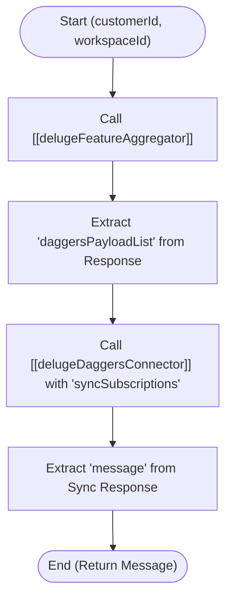

**Postman Documentation:** [Link to API Collection Placeholder]

---

## Overview
The `ResyncDaggers` function is a standalone utility within the Cordulus ecosystem designed to synchronize subscription-related feature data for a specific customer into the "Daggers" system. It acts as an orchestrator that first aggregates customer feature data via a centralized aggregator and then pushes that data to the Daggers synchronization handler. This is typically used to ensure that the external Daggers service reflects the most current subscription state of a customer's workspace.

## Technical Contract
- **Input:** 
    - `int customerId`: The unique internal ID of the customer.
    - `int workspaceId`: The specific workspace ID where the synchronization should be applied.
- **Output:** 
    - `string`: A status message returned by the Daggers connector (e.g., "Success" or error details).
- **Primary Entities:** 
    - `delugeFeatureAggregator`
    - `delugeDaggersConnector`
    - `Daggers Payload` (JSON List)

## Dependency Map
This script orchestrates the following internal functions and external services:

| Function / Service | Purpose | Criticality |
| --- | --- | --- |
| [[delugeFeatureAggregator]] | Fetches and formats subscription/feature data based on customer and country. | High |
| [[delugeDaggersConnector]] | Communicates with the Daggers API to perform the "syncSubscriptions" action. | High |

## Logic Flow

## Core Logic Sections

### 1. Feature Aggregation
The script initializes fixed parameters for `orgId` (20087400261) and `country` ("Denmark"). It then calls `standalone.delugeFeatureAggregator` to retrieve a structured map containing customer entitlement data.

### 2. Payload Extraction
From the aggregator's response, the script specifically targets the `daggersPayloadList` key. This list contains the pre-processed subscription data formatted specifically for the Daggers integration requirements.

### 3. Daggers Synchronization
The script invokes `standalone.delugeDaggersConnector`, passing the `syncSubscriptions` action, the target `workspaceId`, and the extracted payload. The final return value is the descriptive message provided by this handler.

## Developer Notes

> [!WARNING]
> This function contains a hardcoded `orgId` (20087400261) and `country` ("Denmark"). This limits the function's utility to the Danish organizational context. If this needs to support international customers, these values must be dynamic or passed as arguments.

> [!IMPORTANT]
> The script assumes that the `delugeFeatureAggregator` will always return a map containing the key `daggersPayloadList`. If the aggregator fails or the key is missing, the subsequent call to the Daggers connector may fail with a null-pointer or empty payload error.

> [!TIP]
> This function is an excellent example of a "Wrapper" or "Orchestrator" pattern, separating the data gathering logic from the external API execution logic.

## Change Log
- **2026-04-01T05:45:22.454Z:** Initial creation of documentation via DeluluDocu.