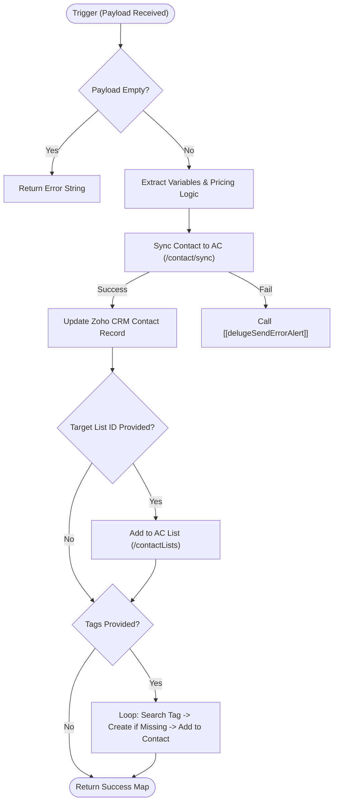

**Postman Documentation:** [Link to API Collection Placeholder]

---

## Overview
The `delugeActiveCampaignHandlerTest` function serves as the primary integration bridge between Zoho CRM/Deluge scripts and the **ActiveCampaign (AC)** marketing automation platform. Its main purpose is to synchronize contact data, update custom marketing fields (including complex pricing/quote data), manage list subscriptions, and dynamically handle tag assignments.

This script ensures that when a lead or contact interacts with Cordulus (e.g., requesting a quote or converting), their profile in ActiveCampaign is immediately enriched with UTM parameters, distributor information, and specific sales sprint pricing details.

## Technical Contract
- **Input:** `String payload` (A JSON-formatted string containing contact details, pricing maps, UTM parameters, and target list/tag IDs).
- **Output:** `Map` (Returns success status and the ActiveCampaign Contact ID) or `String` (Error message).
- **Primary Entities:** 
    - ActiveCampaign API (v3)
    - Zoho CRM (Contacts Module)

## Dependency Map
This script orchestrates the following internal functions and external services:

| Function / Service | Purpose | Criticality |
| --- | --- | --- |
| [[delugeSendErrorAlert]] | Handles error logging and notifications for API failures. | High |
| ActiveCampaign API | External service for contact and marketing automation management. | Critical |
| Zoho CRM API | Used to update the `ActiveCampaign_Contact_ID` field on Contact records. | Medium |

## Logic Flow

## Core Logic Sections

### 1. Payload Parsing & Pricing Extraction
The script extracts standard contact info (email, names, IDs) and handles a nested `pricing` map. It calculates differences between "Startup Prices" and "Subscription Prices" across sales sprints and pricelists, preparing these as custom field values for ActiveCampaign.

### 2. Contact Syncing & Zoho CRM Feedback
Using the ActiveCampaign `/contact/sync` endpoint, the script performs an upsert. 
- It maps data to specific AC Custom Field IDs (e.g., ID `64` for `offerStartup`).
- Upon a successful HTTP 200/201 response, it immediately writes the `finalAcContactId` back to the Zoho CRM Contact record to maintain a persistent link between the two systems.

### 3. Subscription Management
If a `targetListId` is provided in the payload, the script ensures the contact is subscribed to that specific mailing list with an "Active" status (`status: "1"`).

### 4. Dynamic Tagging Engine
The script processes a list of tags. For each tag:
1. It searches ActiveCampaign to see if the tag already exists by name.
2. If the tag does not exist, it creates the tag dynamically.
3. It associates the tag ID with the contact.

## Developer Notes

> [!WARNING]
> **Hardcoded Field IDs:** The script relies on hardcoded ActiveCampaign Custom Field IDs (e.g., `customFields.put("64", offerStartup)`). If the ActiveCampaign custom field schema is modified or fields are deleted/recreated in the AC UI, this script **will break** or map data to the wrong fields.

> [!IMPORTANT]
> **Connection Dependency:** This script requires a valid Zoho Deluge Connection named `activecampaign` with sufficient scopes to read/write contacts, lists, and tags.

> [!TIP]
> The `contact/sync` endpoint is used instead of a standard POST to `/contacts`. This is preferred as it handles deduplication based on email automatically, reducing the need for manual "search-then-update" logic.

## Change Log
- **2026-03-26T11:30:08.862Z:** Initial creation of documentation via DeluluDocu. Added logic for pricing field mapping and dynamic tag creation.