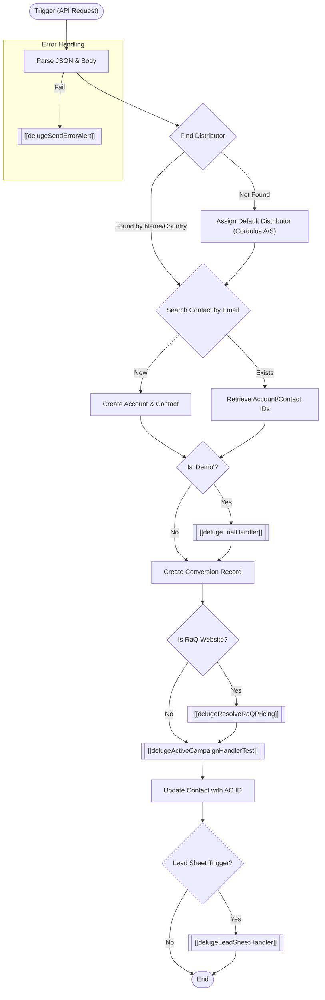

**Postman Documentation:** [Link to API Collection Placeholder]

---

## Overview
The `delugeLeadHandlerTest` script serves as a centralized processing engine for incoming leads within the Cordulus ecosystem. Triggered via API/Webhook, it orchestrates the parsing of lead data, identification of distributors, creation or matching of CRM Accounts and Contacts, management of trial subscriptions, and synchronization with ActiveCampaign and Google Lead Sheets. It ensures data consistency across the CRM and marketing automation platforms while applying specific business logic based on the conversion type (e.g., "Request a Quote" vs. "Demo").

## Technical Contract
- **Input:** `String crmAPIRequest` (A JSON string containing lead details such as email, fullName, country, distributor, and UTM parameters).
- **Output:** `String` (Returns an empty string on success or `"Error"` on failure).
- **Primary Entities:** `Accounts`, `Contacts`, `Conversions`, `ActiveCampaign`.

## Dependency Map
This script orchestrates the following internal functions and external services:

| Function / Service | Purpose | Criticality |
| --- | --- | --- |
| [[delugeTrialHandler]] | Manages the creation of trial subscriptions if the conversion type is a "Demo". | High |
| [[delugeResolveRaQPricing]] | Retrieves pricing data for "Request a Quote" conversions based on the distributor. | Medium |
| [[delugeActiveCampaignHandlerTest]] | Syncs contact data, UTMs, and tags to ActiveCampaign. | High |
| [[delugeLeadSheetHandler]] | Pushes lead data to external distributor spreadsheets and sends notifications. | Medium |
| [[delugeSendErrorAlert]] | Global error handler for reporting script failures via email/alert. | High |

## Logic Flow

## Core Logic Sections

### 1. Data Normalization & Parsing
The script extracts the `body` from the input string. It performs name splitting logic, separating `fullName` into `firstName` and `lastName`. If a last name is missing, it defaults to `"-"` to satisfy CRM requirements.

### 2. Distributor Identification Logic
Distributors are identified in a hierarchical manner:
1.  **Direct Match:** Search `Accounts` by Name provided in the request.
2.  **Fallback (Country):** Search `Accounts` by Billing Country where `Default_Distributor_for_Country` is true.
3.  **Global Fallback:** Hardcoded ID `520877000145481486` (Cordulus A/S).

### 3. CRM Record Orchestration
The script prevents duplicates by searching for existing `Contacts` via email.
- **If match found:** It inherits the existing `Account` and `ActiveCampaign_Contact_ID`.
- **If no match:** It creates a new `Account` (named after the user) and a new `Contact` linked to that Account.

### 4. Conversion & External Integration
- **Conversions:** A record is created in the `Conversions` module, capturing UTM data, vertical (Farm/Industrial), and distributor links.
- **ActiveCampaign:** Data is passed to `[[delugeActiveCampaignHandlerTest]]`. This handles list assignment (List ID 35 for Farm, 62 for others) and tag application.
- **Lead Sheets:** Specifically for "Request a Quote" conversions NOT coming from the main website, it triggers the Lead Sheet automation.

## Developer Notes

> [!IMPORTANT]
> The script currently contains a hardcoded `crmAPIRequest` override at the very beginning for testing purposes. This **must** be removed before production deployment to allow real parameters to flow through.

> [!WARNING]
> The `defaultDistributorId` (520877000145481486) is hardcoded. If the "Cordulus A/S" account record is deleted or its ID changed in the CRM, this script will fail to associate records correctly.

> [!NOTE]
> Pricing resolution via `[[delugeResolveRaQPricing]]` only triggers if `utmSource` is exactly "Website" and the conversion name contains "Request a Quote".

## Change Log
- **2026-03-27T13:30:12.825Z:** Initial creation of documentation via DeluluDocu. 
- **Current Version:** Added support for multi-handler orchestration (Trial, Pricing, AC, and Lead Sheets) and unified error reporting.