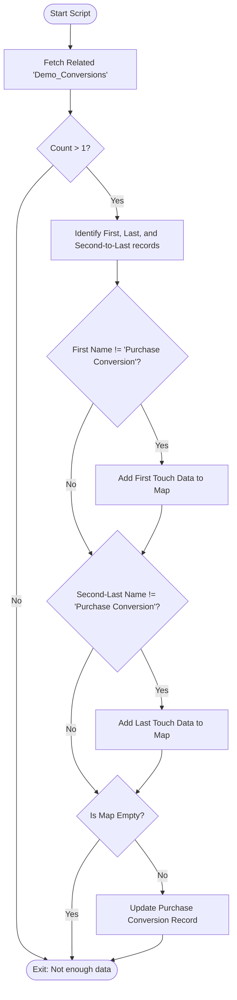

**Postman Documentation:** [Link to API Collection Placeholder]

---

## Overview
This script is designed to perform attribution analysis for a specific "Purchase Conversion" record. It is typically triggered via a custom button on an Account or Conversion record. The script retrieves all conversions associated with an Account, identifies the "First Touch" (the earliest conversion) and the "Last Touch" (the conversion immediately preceding the purchase), and calculates the duration in days between these touches and the purchase date. The resulting data is then written back to the specific Purchase Conversion record to enrich marketing attribution reports.

## Technical Contract
- **Input:** 
    - `account_id` (Int): The unique identifier for the Zoho CRM Account.
    - `purchase_conversion_id` (Int): The ID of the specific conversion record being updated.
    - `purchase_conversion_created_time` (Date): The timestamp of when the purchase occurred.
- **Output:** `string` (Returns an empty string upon completion).
- **Primary Entities:** 
    - `Accounts`
    - `Demo_Conversions` (API name used for related list)
    - `Conversions` (API name used for update task)

## Dependency Map
This script orchestrates the following internal functions and external services:

| Function / Service | Purpose | Criticality |
| --- | --- | --- |
| `zoho.crm.getRelatedRecords` | Fetches all conversion history for the specific Account. | High |
| `zoho.crm.updateRecord` | Updates the Purchase Conversion with calculated attribution data. | High |

## Logic Flow

## Core Logic Sections

### 1. Data Retrieval and Sequencing
The script fetches all records from the `Demo_Conversions` related list. It assumes the default sort order (typically Newest First). 
- `conversions.get(0)` is treated as the most recent conversion (the current Purchase).
- `conversions.get(1)` is treated as the "Last Touch".
- `conversions.get(number_of_conversions - 1)` is treated as the "First Touch".

### 2. Attribution Validation
The script includes logic to ensure that a "Purchase Conversion" is not attributed to itself. It checks if the names of the identified First and Last touches are equal to "Purchase Conversion". If they are, that specific touchpoint is skipped in the data mapping.

### 3. Time-to-Purchase Calculation
The script utilizes the `.daysBetween()` function to calculate the velocity of the customer journey:
- `Time_from_First_Touch_to_Purchase_Days`
- `Time_from_Last_Touch_to_Purchase_Days`

### 4. Data Persistence
If eligible attribution data is found, the `purchase_conversion_data` map is passed to the `zoho.crm.updateRecord` task targeting the `Conversions` module.

## Developer Notes

> [!WARNING]
> The script uses `Demo_Conversions` to fetch records but `Conversions` to update them. Ensure that these refer to the correct API names of the module/sub-module.

> [!IMPORTANT]
> The logic assumes that `zoho.crm.getRelatedRecords` returns records in descending order of creation. If the sort order in the CRM settings is changed to ascending, the attribution logic (First vs. Last) will be reversed.

> [!NOTE]
> The `org_id` variable is initialized but not explicitly used in the `zoho.crm` tasks. This may be a leftover from a previous implementation or intended for future webhooks.

## Change Log
- **2026-03-25T13:56:30.478Z:** Initial creation of documentation via DeluluDocu.