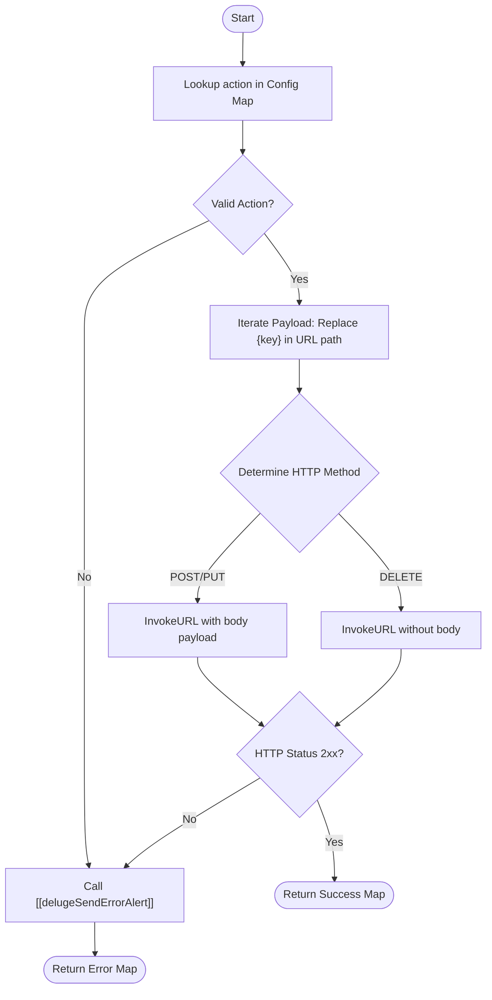

**Postman Documentation:** [Link to API Collection Placeholder]

---

## Overview
The `delugePopulaceConnector` serves as a centralized gateway for all integrations between Zoho and the Populace API (`populace.cordulus.com`). It acts as an abstraction layer that standardizes how various entities—such as Users, Workspaces, Distributors, and Memberships—are created, updated, or deleted in the external Populace system.

This function is designed to be called by other scripts within the Cordulus ecosystem whenever a data sync or administrative action needs to be pushed to the Populace microservice.

## Technical Contract
- **Input:** 
    - `action` (String): The logical operation to perform (e.g., "createUser", "addWorkspaceToDistributor").
    - `payload` (Map): The data packet containing both URL path parameters (like `userId`) and the JSON body for the request.
- **Output:** A Map containing:
    - `success` (Boolean): Indicates if the API call was successful (200, 201, or 204).
    - `data` (String): The raw response text from the API on success.
    - `error_message` (String): A descriptive error message if the call fails.
- **Primary Entities:** 
    - Populace API
    - Zoho CRM/Books (as the triggering source)

## Dependency Map
This script orchestrates the following internal functions and external services:

| Function / Service | Purpose | Criticality |
| --- | --- | --- |
| [[delugeSendErrorAlert]] | Standardized error reporting for failed API calls. | High |
| Populace API | External microservice for managing users and workspaces. | Mission Critical |
| Zoho Connection: `populace` | OAuth/API Key authentication for the Populace endpoint. | Mission Critical |

## Logic Flow

## Core Logic Sections

### 1. Endpoint Configuration
The script maintains an internal configuration map (`config`) that translates logical actions into specific HTTP methods (`POST`, `PUT`, `DELETE`) and URL path templates. This ensures that the caller only needs to know the "Action" name rather than the specific REST implementation details.

### 2. Dynamic URL Interpolation
The script iterates through the `payload` map. If a key in the payload matches a placeholder in the URL path (e.g., `{userId}`), it encodes the value, replaces the placeholder in the string, and removes that key from the payload so it isn't sent twice (once in the URL and once in the JSON body).

### 3. Standardized HTTP Execution
It utilizes the `invokeurl` task with a dedicated connection named `populace`. It supports three primary methods:
- **POST/PUT:** Sends remaining payload data as a JSON string in the parameters.
- **DELETE:** Sends the request without a body, primarily using URL parameters.

### 4. Response Handling & Alerting
The script validates the `responseCode` against a set of success codes (`200`, `201`, `204`). Any other code or an execution exception triggers an automated alert via `[[delugeSendErrorAlert]]`, providing the technical details and payload for debugging.

## Developer Notes

> [!IMPORTANT]
> This script relies on a Zoho Connection named `populace`. Ensure this connection is shared and has the necessary scopes/headers configured for the Populace API.

> [!TIP]
> When calling this function, if a value is needed in the URL path (like `workspaceId`), ensure the key in your input `payload` map matches the placeholder in the `config` exactly.

> [!CAUTION]
> The script currently uses `payload.toString()` for the `parameters` field in `invokeurl`. Ensure the payload map does not contain complex nested objects that Zoho's default `toString()` might format incorrectly for JSON; if issues arise, consider using `payload.toJSONString()`.

## Change Log
- **2026-03-19T17:28:47.217Z:** Initial creation of documentation via DeluluDocu.