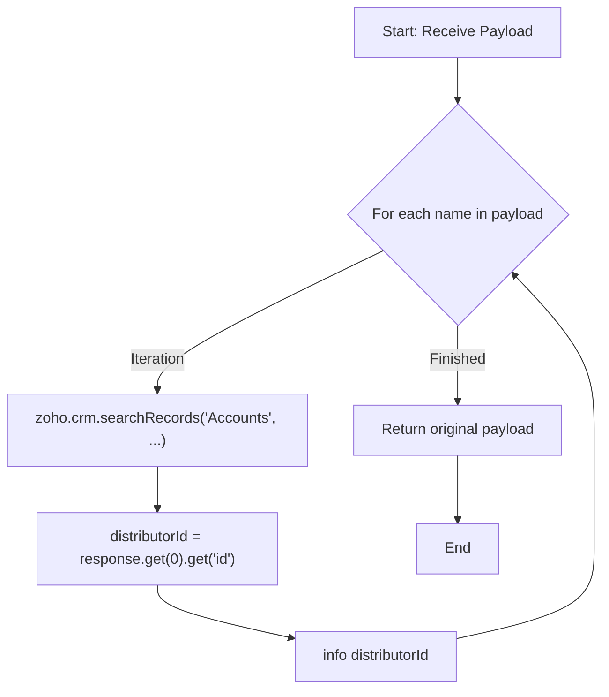

**Postman Documentation:** [Link to API Collection Placeholder]

---

## Overview
The `delugeSendToActiveCampaignLimit` function is a validation utility that iterates through a payload to verify the existence of Account records in Zoho CRM. In its latest iteration, the script correctly handles the list response from CRM search queries to extract and log the specific CRM Record ID (`distributorId`) for each account found.

## Technical Contract
- **Input:** `String payload` (Expected to be an iterable collection or a string that can be parsed as one).
- **Output:** `String` (The original payload returned back to the caller).
- **Primary Entities:** 
    - Zoho CRM (Accounts Module)
    - ActiveCampaign (Contextual destination)
    - Zoho Standalone Functions (Environment)

## Dependency Map
This script orchestrates the following internal functions and external services:

| Function / Service | Purpose | Criticality |
| --- | --- | --- |
| Zoho CRM (Accounts) | Searches for account records based on the names provided in the payload. | High |

## Logic Flow
The function iterates through the input, performs a CRM lookup, accesses the first record in the returned list, extracts the unique Record ID, and logs it.

## Core Logic Sections
The script consists of the following logical components:

### 1. Iterable Payload Processing
The function treats the `payload` parameter as a collection. It enters a `for each` loop to process individual items (names) within the payload.

### 2. CRM Account Verification
For every name extracted from the payload, the script executes a `zoho.crm.searchRecords` call against the **Accounts** module. It uses a criteria search to find records where the `Account_Name` exactly matches the provided name.

### 3. ID Extraction (List Handling)
The script handles the `zoho.crm.searchRecords` response as a list. By using `.get(0)`, it targets the first matching record found in the CRM and retrieves its unique `id`. This value is assigned to `distributorId` and logged.

## Developer Notes

> [!CAUTION]
> The `payload` parameter is defined as a `String`. If a primitive string is passed instead of a list/collection, the `for each` loop may only execute once or fail depending on the caller's implementation. Ensure the calling script passes a list variable.

> [!IMPORTANT]
> This script performs a CRM search inside a loop. If the `payload` contains a large number of items, this will consume significant API tasks and may hit Zoho's execution timeout or statement limits.

> [!TIP]
> The latest update fixed a bug where the script attempted to call `.get("id")` directly on a list object. The addition of `.get(0)` ensures the script correctly navigates the search results to find the record map before requesting the ID.

> [!CAUTION]
> While the script now correctly indexes the response, it does not yet check if the search result is empty. If no record is found, `.get(0)` will return null and the subsequent `.get("id")` may trigger a script error. A null check (e.g., `if(response.size() > 0)`) is recommended for production resilience.

## Change Log
- **2026-03-24T13:44:57.179Z:** Initial creation of documentation via DeluluDocu.
- **2026-03-24T14:16:16.993Z:** Updated script logic to include a `for each` loop and `zoho.crm.searchRecords` integration. The function now validates account names against the CRM database instead of simply logging the raw payload.
- **2026-03-24T14:17:58.763Z:** Updated logic to extract the specific CRM Record ID (`distributorId`) from the search response and log it, rather than logging the entire search result object.
- **2026-03-24T14:18:26.815Z:** Corrected index handling for CRM search results. The script now properly accesses the first element of the returned list (`.get(0)`) to extract the record ID, resolving a bug where IDs were not being captured from the response list.