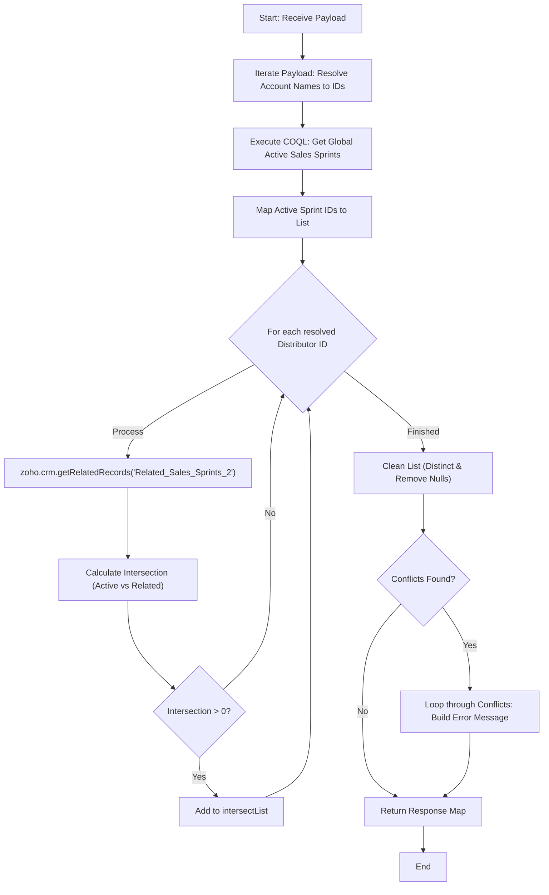

**Postman Documentation:** [Link to API Collection Placeholder]

---

## Overview
The `delugeSendToActiveCampaignLimit` function is a validation utility designed to identify intersections between specific Accounts (distributors) and currently active Sales Sprints. It processes a payload of names, resolves them to CRM IDs, fetches globally active Sales Sprints via COQL, and determines which distributors are associated with those active sprints. The latest update adds a validation layer that returns a structured error message if conflicts are detected.

## Technical Contract
- **Input:** `String payload` (Expected to be an iterable collection of Account names).
- **Output:** `String` (A stringified Map containing `status` and `message` if conflicts exist, or the COQL response object).
- **Primary Entities:** 
    - Zoho CRM (Accounts Module)
    - Zoho CRM (Sales_Sprints Module)
    - COQL (CRM Object Query Language)
    - ActiveCampaign (Contextual destination)

## Dependency Map
This script orchestrates the following internal functions and external services:

| Function / Service | Purpose | Criticality |
| --- | --- | --- |
| Zoho CRM (Accounts) | Searches for account records based on names. | High |
| Zoho CRM (COQL) | Fetches active Sales Sprints via `https://www.zohoapis.eu/crm/v2/coql`. | High |
| Connection: `zohocrmconnection` | OAuth2 connection for COQL API execution. | High |
| Zoho CRM (Related Records) | Retrieves "Related_Sales_Sprints_2" for specific Accounts. | High |

## Logic Flow
The function resolves Account names to IDs, queries the CRM for globally active Sales Sprints, and iterates through distributors to find overlaps. It then validates the results to generate a descriptive conflict message.

## Core Logic Sections
The script consists of the following logical components:

### 1. Distributor Resolution
The script loops through the input `payload`, performing a `zoho.crm.searchRecords` for each name. It builds a list of CRM Record IDs (`distributors`) for further processing.

### 2. Global Active Sprint Discovery (COQL)
Utilizes a COQL query to target the `Sales_Sprints` module, filtering for records where `Sales_Sprint_Active` is 'Yes' and `Send_to_Active_Campaign` is true.

### 3. Relationship Intersection Logic
For every resolved distributor, the script:
1.  Fetches their specific related sprints via `getRelatedRecords`.
2.  Uses the `.intersect()` method to find common IDs between the global "Active" list and the distributor's "Related" list.

### 4. Validation and Conflict Reporting
The script evaluates the `intersectList`. If not empty, it iterates through the unique conflict IDs to find the corresponding distributor names from the last retrieved `relatedSalesSprints` set and updates the `response` map with an "error" status and a detailed string listing the conflicting entities.

## Developer Notes

> [!IMPORTANT]
> This script uses an `invokeurl` call for COQL using the `zohocrmconnection`. Ensure this connection exists in the Zoho environment with the `ZohoCRM.coql.READ` scope.

> [!CAUTION]
> **Logic Limitation:** The validation loop for `conflictMessage` relies on the `relatedSalesSprints` variable. However, this variable is updated inside the distributor loop. Consequently, the final validation logic only has access to the related records of the *last* distributor processed in the payload. If conflicts occur across multiple different distributors, the name mapping in the error message may be incomplete or incorrect.

> [!CAUTION]
> **Performance Warning:** The script performs a `getRelatedRecords` call *inside* a loop for every distributor in the payload. If the payload contains many names, this will execute multiple additional API calls, potentially hitting CRM limits.

> [!TIP]
> The function signature returns a `String`, but the script returns the `response` variable (which is a Map). Zoho Deluge will automatically serialize this Map to a JSON string upon return.

## Change Log
- **2026-03-24T13:44:57.179Z:** Initial creation of documentation via DeluluDocu.
- **2026-03-24T14:16:16.993Z:** Updated script logic to include a `for each` loop and `zoho.crm.searchRecords` integration.
- **2026-03-24T14:17:58.763Z:** Updated logic to extract the specific CRM Record ID (`distributorId`) from the search response.
- **2026-03-24T14:18:26.815Z:** Corrected index handling for CRM search results using `.get(0)`.
- **2026-03-24T14:22:02.736Z:** Major update: Integrated COQL query to fetch active Sales Sprints and implemented intersection logic to validate distributors against active sprints. Added `invokeurl` dependency and related record processing.
- **2026-03-24T14:23:01.022Z:** Maintenance: Commented out several `info` debug statements throughout the script to clean up execution output while preserving core logic.
- **2026-03-24T14:27:12.400Z:** Added Part B: Validation Logic. The script now performs a distinct check on conflicts and returns a structured "error" status map with a descriptive `conflictMessage` containing Distributor names and IDs if intersections are found.