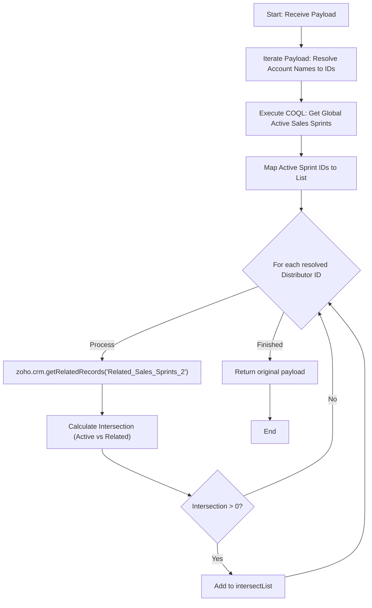

**Postman Documentation:** [Link to API Collection Placeholder]

---

## Overview
The `delugeSendToActiveCampaignLimit` function is a complex validation utility designed to identify intersections between specific Accounts (distributors) and currently active Sales Sprints. It processes a payload of names, resolves them to CRM IDs, fetches globally active Sales Sprints via COQL, and determines which distributors are associated with those active sprints.

## Technical Contract
- **Input:** `String payload` (Expected to be an iterable collection of Account names).
- **Output:** `String` (The original payload returned back to the caller).
- **Primary Entities:** 
    - Zoho CRM (Accounts Module)
    - Zoho CRM (Sales_Sprints Module)
    - COQL (CRM Object Query Language)
    - ActiveCampaign (Contextual destination)

## Dependency Map
This script orchestrates the following internal functions and external services:

| Function / Service | Purpose | Criticality |
| --- | --- | --- |
| Zoho CRM (Accounts) | Searches for account records based on names. | High |
| Zoho CRM (COQL) | Fetches active Sales Sprints via `https://www.zohoapis.eu/crm/v2/coql`. | High |
| Connection: `zohocrmconnection` | OAuth2 connection for COQL API execution. | High |
| Zoho CRM (Related Records) | Retrieves "Related_Sales_Sprints_2" for specific Accounts. | High |

## Logic Flow
The function resolves Account names to IDs, queries the CRM for globally active Sales Sprints, then iterates through each Account to find where their related sprints overlap with the global active list.

## Core Logic Sections
The script consists of the following logical components:

### 1. Distributor Resolution
The script loops through the input `payload`, performing a `zoho.crm.searchRecords` for each name. It builds a list of CRM Record IDs (`distributors`) for further processing.

### 2. Global Active Sprint Discovery (COQL)
Instead of standard search, the script utilizes a COQL query to target the `Sales_Sprints` module. It specifically filters for records where `Sales_Sprint_Active` is 'Yes' and `Send_to_Active_Campaign` is true. This bypasses standard API search limitations for complex criteria.

### 3. Relationship Intersection Logic
For every resolved distributor, the script:
1.  Fetches their specific related sprints via `getRelatedRecords`.
2.  Extracts the IDs of those related sprints.
3.  Uses the `.intersect()` method to find common IDs between the global "Active" list and the distributor's "Related" list.

## Developer Notes

> [!IMPORTANT]
> This script uses an `invokeurl` call for COQL using the `zohocrmconnection`. Ensure this connection exists in the Zoho environment with the `ZohoCRM.coql.READ` scope.

> [!CAUTION]
> **Performance Warning:** The script now performs a `getRelatedRecords` call *inside* a loop for every distributor in the payload. If the payload contains 50 names, this will execute 50 additional API calls. This may lead to "Internal Limit Exceeded" errors in high-volume environments.

> [!NOTE]
> The COQL query targets `https://www.zohoapis.eu/crm/v2/coql`. If this script is deployed in a non-EU data center (e.g., .com or .in), the URL must be updated to match the regional API endpoint.

> [!TIP]
> While the script calculates the `intersectList`, it currently does not perform an action with this list (like updating a record or sending an email) before returning the payload. This logic appears to be a foundation for a future "Send to ActiveCampaign" trigger.

## Change Log
- **2026-03-24T13:44:57.179Z:** Initial creation of documentation via DeluluDocu.
- **2026-03-24T14:16:16.993Z:** Updated script logic to include a `for each` loop and `zoho.crm.searchRecords` integration.
- **2026-03-24T14:17:58.763Z:** Updated logic to extract the specific CRM Record ID (`distributorId`) from the search response.
- **2026-03-24T14:18:26.815Z:** Corrected index handling for CRM search results using `.get(0)`.
- **2026-03-24T14:22:02.736Z:** Major update: Integrated COQL query to fetch active Sales Sprints and implemented intersection logic to validate distributors against active sprints. Added `invokeurl` dependency and related record processing.