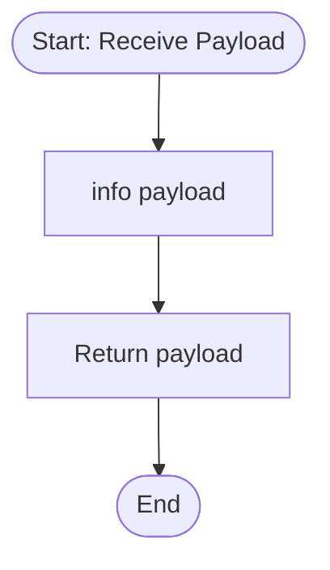

**Postman Documentation:** [Link to API Collection Placeholder]

---

## Overview
The `delugeSendToActiveCampaignLimit` function serves as a utility or placeholder script within the Cordulus ecosystem, specifically designed to interface with ActiveCampaign integration logic. Currently, its primary role is to receive a string payload, log it for debugging purposes, and return it. Based on its naming convention, it is intended to eventually manage or monitor API rate limits or payload constraints for outbound ActiveCampaign communications.

## Technical Contract
- **Input:** `String payload` (The data string intended for processing or transmission).
- **Output:** `String` (The original payload returned back to the caller).
- **Primary Entities:** 
    - ActiveCampaign (External Service context)
    - Zoho Standalone Functions (Environment)

## Dependency Map
This script orchestrates the following internal functions and external services:

| Function / Service | Purpose | Criticality |
| --- | --- | --- |
| None | No internal script dependencies identified. | N/A |

## Logic Flow
The current architectural logic is a direct pass-through with a logging side-effect.

## Core Logic Sections
The script is currently composed of a single logical pillar.

### 1. Data Logging and Pass-through
The function accepts a string parameter. It utilizes the `info` statement to record the contents of the `payload` in the Zoho Deluge execution logs. This is typically used for auditing data flow or debugging integration triggers before the data is returned to the parent process.

## Developer Notes

> [!NOTE]
> This function currently acts as a "Skeleton" or "Pass-through" script. It does not yet contain logic to calculate limits, throttle requests, or modify the payload.

> [!TIP]
> Use this function as a hook point if you need to implement global validation or character limit checks for data being sent to ActiveCampaign across multiple modules.

## Change Log
- **2026-03-24T13:44:57.179Z:** Initial creation of documentation via DeluluDocu.