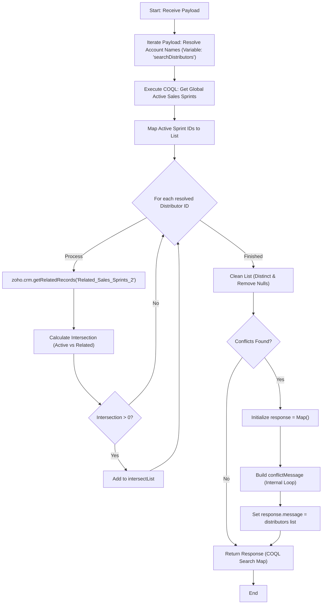

**Postman Documentation:** [Link to API Collection Placeholder]

---

## Overview
The `delugeSendToActiveCampaignLimit` function is a validation utility designed to identify intersections between specific Accounts (distributors) and currently active Sales Sprints. It processes a payload of names, resolves them to CRM IDs, fetches globally active Sales Sprints via COQL, and determines which distributors are associated with those active sprints. The latest update improves variable scoping to prevent collisions and modifies the error reporting output.

## Technical Contract
- **Input:** `String payload` (Expected to be an iterable collection of Account names).
- **Output:** `String` (A stringified Map containing `status` and `message` if conflicts exist. Note: In the latest version, the message returns the raw list of distributor IDs).
- **Primary Entities:** 
    - Zoho CRM (Accounts Module)
    - Zoho CRM (Sales_Sprints Module)
    - COQL (CRM Object Query Language)
    - ActiveCampaign (Contextual destination)

## Dependency Map
This script orchestrates the following internal functions and external services:

| Function / Service | Purpose | Criticality |
| --- | --- | --- |
| Zoho CRM (Accounts) | Searches for account records based on names and `Distributor_Type`. | High |
| Zoho CRM (COQL) | Fetches active Sales Sprints via `https://www.zohoapis.eu/crm/v2/coql`. | High |
| Connection: `zohocrmconnection` | OAuth2 connection for COQL API execution. | High |
| Zoho CRM (Related Records) | Retrieves "Related_Sales_Sprints_2" for specific Accounts. | High |

## Logic Flow
The function resolves Account names to IDs, queries the CRM for globally active Sales Sprints, and iterates through distributors to find overlaps. It then generates a response map based on detected conflicts.

## Core Logic Sections
The script consists of the following logical components:

### 1. Distributor Resolution (Refactored)
The script loops through the input `payload`, performing a `zoho.crm.searchRecords` for each name. The latest update renamed the internal search variable to `searchDistributors` to avoid name shadowing with the subsequent COQL `search` variable.

### 2. Global Active Sprint Discovery (COQL)
Utilizes a COQL query to target the `Sales_Sprints` module, filtering for records where `Sales_Sprint_Active` is 'Yes' and `Send_to_Active_Campaign` is true.

### 3. Relationship Intersection Logic
For every resolved distributor, the script:
1.  Fetches their specific related sprints via `getRelatedRecords`.
2.  Uses the `.intersect()` method to find common IDs between the global "Active" list and the distributor's "Related" list.

### 4. Validation and Conflict Reporting (Output Change)
The script evaluates the `intersectList`. If conflicts exist:
1.  The `response` variable is explicitly initialized.
2.  **Logic Change:** While the script still iterates to build a descriptive `conflictMessage` string, the final `response.message` has been updated to return the raw `distributors` list (the list of IDs identified from the payload).

## Developer Notes

> [!TIP]
> **Variable Scoping:** The variable used for Account search results has been changed from `search` to `searchDistributors`. This prevents logic errors where the COQL response might have been overwritten or confused with distributor search results.

> [!IMPORTANT]
> This script uses an `invokeurl` call for COQL using the `zohocrmconnection`. Ensure this connection exists in the Zoho environment with the `ZohoCRM.coql.READ` scope.

> [!CAUTION]
> **Reporting Regression:** In the latest revision, the error message returned to the user/calling system changed from a detailed conflict string (`conflictMessage`) to the raw list of distributor IDs (`distributors`). This may make troubleshooting more difficult for end-users as it lacks the "Account Name (ID)" formatting previously provided.

> [!CAUTION]
> **Logic Limitation:** The validation loop for `conflictMessage` continues to rely on the `relatedSalesSprints` variable, which is updated inside the distributor loop. Consequently, the detailed (though currently unused) `conflictMessage` only accurately reflects the last distributor processed.

## Change Log
- **2026-03-24T13:44:57.179Z:** Initial creation of documentation via DeluluDocu.
- **2026-03-24T14:16:16.993Z:** Updated script logic to include a `for each` loop and `zoho.crm.searchRecords` integration.
- **2026-03-24T14:17:58.763Z:** Updated logic to extract the specific CRM Record ID (`distributorId`) from the search response.
- **2026-03-24T14:18:26.815Z:** Corrected index handling for CRM search results using `.get(0)`.
- **2026-03-24T14:22:02.736Z:** Major update: Integrated COQL query to fetch active Sales Sprints and implemented intersection logic to validate distributors against active sprints. Added `invokeurl` dependency and related record processing.
- **2026-03-24T14:23:01.022Z:** Maintenance: Commented out several `info` debug statements throughout the script to clean up execution output while preserving core logic.
- **2026-03-24T14:27:12.400Z:** Added Part B: Validation Logic. The script now performs a distinct check on conflicts and returns a structured "error" status map with a descriptive `conflictMessage` containing Distributor names and IDs if intersections are found.
- **2026-03-24T14:28:35.469Z:** Bug fix and Refactor: Renamed intermediate API result variables from `response` to `search` to prevent variable collision. Explicitly initialized `response = Map()` within the validation block to ensure a clean error object is returned when conflicts are detected.
- **2026-03-24T14:32:42.641Z:** Search Filter Refinement: Updated the `zoho.crm.searchRecords` call for Accounts to include a mandatory check for `Distributor_Type:equals:Farm_Distributor`. Commented out remaining `info` debug statements.
- **2026-03-24T14:34:06.209Z:** **Syntax Fix:** Corrected the CRM search criteria string by adding the missing closing parenthesis to the `Account_Name` and `Distributor_Type` logic.
- **2026-03-24T14:34:33.683Z:** **Data Filter Update:** Modified the `Distributor_Type` search criteria from `Farm_Distributor` to `Farm Distributor` to match the updated picklist value in CRM.
- **2026-03-24T14:35:23.029Z:** **Variable Refactor & Output Update:** Renamed initial search variable to `searchDistributors` to prevent potential shadowing with COQL search results. Updated the final error response message to return the `distributors` ID list instead of the formatted `conflictMessage` string.