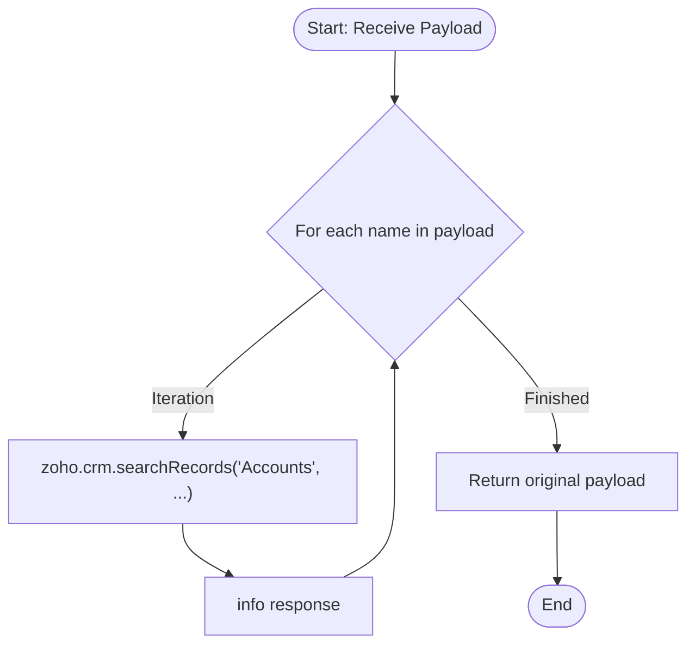

**Postman Documentation:** [Link to API Collection Placeholder]

---

## Overview
The `delugeSendToActiveCampaignLimit` function has been updated from a simple pass-through utility to a validation script. It now iterates through the provided payload to verify the existence of specific Account records within Zoho CRM. While it still returns the original payload, it now serves as an intermediary check to log CRM data related to the names provided in the input.

## Technical Contract
- **Input:** `String payload` (Expected to be an iterable collection or a string that can be parsed as one).
- **Output:** `String` (The original payload returned back to the caller).
- **Primary Entities:** 
    - Zoho CRM (Accounts Module)
    - ActiveCampaign (Contextual destination)
    - Zoho Standalone Functions (Environment)

## Dependency Map
This script orchestrates the following internal functions and external services:

| Function / Service | Purpose | Criticality |
| --- | --- | --- |
| Zoho CRM (Accounts) | Searches for account records based on the names provided in the payload. | High |

## Logic Flow
The function iterates through the input, performs a CRM lookup for each item, and logs the result before returning the data.

## Core Logic Sections
The script consists of the following logical components:

### 1. Iterable Payload Processing
The function treats the `payload` parameter as a collection. It enters a `for each` loop to process individual items (names) within the payload.

### 2. CRM Account Verification
For every name extracted from the payload, the script executes a `zoho.crm.searchRecords` call against the **Accounts** module. It uses a criteria search to find records where the `Account_Name` exactly matches the provided name.

### 3. Execution Logging
The results of the CRM search (`response`) are logged using the `info` statement. This is critical for auditing which accounts were found or missing during the process.

## Developer Notes

> [!CAUTION]
> The `payload` parameter is defined as a `String`. If a primitive string is passed instead of a list/collection, the `for each` loop may only execute once or fail depending on the caller's implementation. Ensure the calling script passes a list variable.

> [!IMPORTANT]
> This script performs a CRM search inside a loop. If the `payload` contains a large number of items, this will consume significant API tasks and may hit Zoho's execution timeout or statement limits.

> [!TIP]
> Use the logged `info response` to troubleshoot why certain records might not be syncing with ActiveCampaign, as this will reveal if the search query is returning empty results.

## Change Log
- **2026-03-24T13:44:57.179Z:** Initial creation of documentation via DeluluDocu.
- **2026-03-24T14:16:16.993Z:** Updated script logic to include a `for each` loop and `zoho.crm.searchRecords` integration. The function now validates account names against the CRM database instead of simply logging the raw payload.